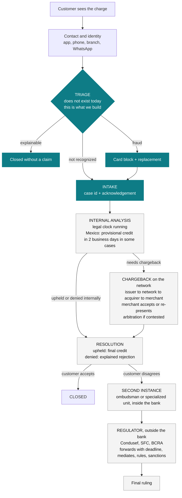
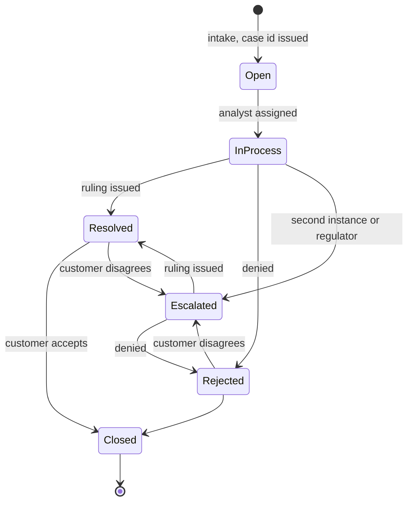

# How an unrecognized-charge dispute works

What happens in real life, which part our system touches, and how it maps to the dataset's states.

## Actors

| Actor | Role |
| --- | --- |
| Customer | Sees the charge and contacts the bank |
| Issuing bank | Receives, analyzes and resolves the dispute; issues the card |
| Card network (Visa, Mastercard) | Arbitrates the chargeback between issuer and acquirer |
| Acquiring bank and merchant | Receive the chargeback and accept or re-present it |
| Bank's second instance | Customer ombudsman or specialized unit, independent but inside the bank |
| Regulator | State entity outside the bank: Condusef in Mexico, Superintendencia Financiera in Colombia, BCRA in Argentina |

The regulator receives the customer's complaint when the bank did not resolve or answer it, forwards it to the bank with a deadline, mediates, rules and can sanction.
In the dataset, `complaints.reception_channel = 'Regulator'` means the complaint reached the bank through the regulator (717 cases).

## Process flow

Teal nodes are what our system touches; grey nodes are human and network work.

## Case state machine

Our system only creates the `Open` state and reads the others; every transition after `Open` is human.

## Mapping to `complaints.status`

| Dataset state | Real stage |
| --- | --- |
| Open | Intake done, no analyst assigned |
| In Process | Internal analysis or chargeback in progress |
| Escalated | Second instance, or received through the regulator |
| Resolved | Ruling issued, pending acceptance or closure |
| Closed | Closed |
| Rejected | Denied |

## What our system touches

- Triage, intake with case id and acknowledgement, card block, and status follow-up.
- Nothing downstream: analysis, chargeback, resolution and any movement of money are human and network work.
- The regulator shows up as a deadline the bot must quote correctly, and as a priority signal: a case that is `Escalated` or came through `Regulator` is never automated, it is transferred.

## Clocks running in parallel

- The country's legal response deadline (see `legal-deadlines.md`).
- The network deadline to start a chargeback: up to 120 days from the transaction on Visa and Mastercard.
- Every day a dispute sits misclassified or without intake burns both.
