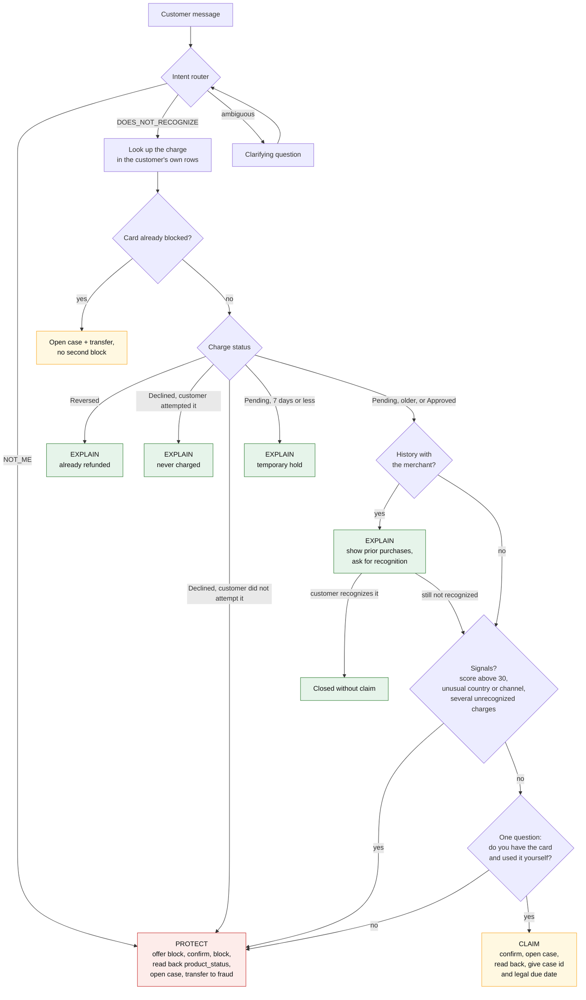

# Triage: explain, claim or protect

The bot never decides whether something is fraud.
It decides whether to protect, which is the cheaper side to be wrong on.
Triage combines verifiable facts about the charge with what the customer says, in that order.

## Step 1: facts about the charge (deterministic, before asking anything)

| Signal | Source | Meaning |
| --- | --- | --- |
| Status Reversed | `transaction_status` | Already refunded: explain and close |
| Status Declined | `transaction_status` + `response_code` | Never charged: explain; a decline the customer did not attempt is a compromised-card signal |
| Status Pending, 7 days or less | `transaction_status` + date | Temporary hold: explain |
| Status Pending, older | same, more than 7 days | Treated as applied: never explained as temporary (99.3% of Pending rows are this old) |
| History with the merchant | prior purchases at `merchant_name` | Likely the customer's own purchase: show them and ask for recognition |
| High bank score | `fraud_score` above 30 | Strong fraud signal by construction of the dataset |
| Transaction country differs from the customer's | `transaction_country` vs `customers.country` | Moderate signal (5% of purchases are abroad) |
| Unusual channel | `channel` Web or App when the customer only buys at POS | Weak signal |
| Card already blocked | `products.product_status` | Already protected: do not block again, go to the case |

## Step 2: what the customer says (intent router)

Two separate intents, not one:

- `DOES_NOT_RECOGNIZE`: "I don't recognize this charge", "what is this", "there is a weird charge". The customer does not know; it can be any of the four situations.
- `NOT_ME`: "I didn't make that purchase", "I don't have the card", "it was stolen", "I gave my code over the phone", "several charges are not mine". The customer states the card or the credentials are out of their control. This is a fraud signal on its own, with no score needed.

The bank's score catches 55% of the fraud in the dataset; the other half can only be raised by the customer with that sentence.
The router is trained with the two classes apart and a minimum recall of 0.95 on `NOT_ME`: over-protecting is preferable to under-protecting.

## Step 3: one question if needed

If the customer said `DOES_NOT_RECOGNIZE` and the facts do not explain the charge, the bot asks exactly one question before deciding: "Do you have the card with you, and have you used it yourself in the last few days?".
The answer moves the case to `NOT_ME` or leaves it as a claim.
This is the first question a real fraud analyst asks: card present or not present.

## Triage flow

## Decision table

| Customer says | Facts about the charge | Outcome |
| --- | --- | --- |
| DOES_NOT_RECOGNIZE | Reversed, normal Declined, or recent Pending | EXPLAIN |
| DOES_NOT_RECOGNIZE | History with the merchant | EXPLAIN showing prior purchases, ask for recognition |
| DOES_NOT_RECOGNIZE | Approved, no signals | Card question; if they have it, CLAIM |
| DOES_NOT_RECOGNIZE | High score, or unusual country or channel | PROTECT: offer block and transfer |
| NOT_ME | Any | PROTECT: offer block, open case, transfer to fraud |
| NOT_ME | Card already blocked | Case plus transfer, no second block |
| Any | Several unrecognized charges in a short window | PROTECT: real fraud is rarely a single charge |

## What the bot never does in triage

- It never says "this is fraud" or "this is not fraud". It says "I will block your card for safety and hand you to the fraud team".
- It never decides about money: no provisional credit, no refund.
- It never unblocks: that needs stronger identity and a human.
- When in doubt, it protects. An unnecessary block costs a card replacement; a missing block costs everything spent until someone acts.

## Limitation to declare

The dataset has no card-present versus card-not-present flag, no transaction velocity and no coherent geolocation, which are the strong signals in real life.
Triage therefore leans on the customer's statement and the bank's score more than on patterns, and the limitations slide says so.
