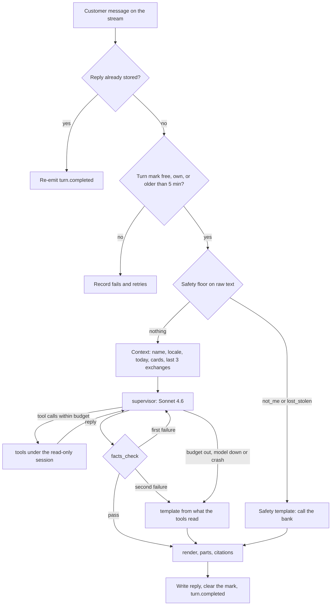
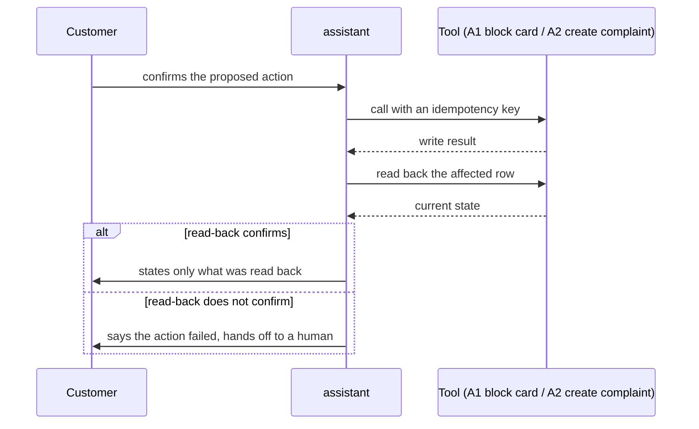

# assistant: flows

Status: the open-mode turn is built (task 0019); writing an action is the B4 design.
The full design is `docs/tasks/_drafts/chat_architecture.md` at the docs root.

## One turn (B1)

Only `supervisor` calls the model; every other box is code, and every value the customer reads comes from a tool's facts through `render`.

## Writing an action: confirm, then read back (B4)

Only `CLAIM` and `PROTECT` reach a write, and the customer never hears "done" before the write is read back.
Customer login is Cognito email and password; there is no OTP inside the chat, only explicit confirmation before the write.

Source: `docs/product/02-technical-flows.md`, "Writes with confirmation and read-back"; `docs/tasks/_drafts/turn_flow.md`, step 10.
A retry with the same idempotency key never blocks a card or opens a case twice.
