# Assistant: flows

Flows of the chatbot lambda, the demo and account routes of the crud lambda, and the customer app's sign-in and Clara chat.
Sending a message, opening a case, sign-up and policy search have their own flows in Messaging, Cases, Identity and Data.

## Answer a customer message

The chatbot lambda consumes each customer message from the messages stream and writes exactly one reply, however often the record is retried.
`chatbot.handler.answer` guards the turn with skip rules, a replay check and a turn mark around `core.turn.run_turn`.

1. The event source mapping on the `messages` table stream keeps only `INSERT` rows whose `sender_type` is `customer`, one record per batch, and invokes `chatbot.handler.handler`, which runs `answer` through `BatchProcessor`.
2. `answer` parses the row with `core.messaging.Message.from_item` and returns early when `sender_type` is not `customer`.
3. `Messaging.room` reads the room with a consistent read.
   A missing room raises `RoomNotFound`, so the record fails and retries.
   A room flagged `delegated_to_human` gets no reply: the turn is skipped and counted in `TurnsSkippedDelegated`.
4. Replay: `Messaging.stored` looks up the deterministic reply key from `core.messaging.reply_key` (same room and `sent_at`, id is the successor of the customer message id).
   When the reply exists, `_turn_completed` re-emits `turn.completed` with route `replayed` and the stored source, and nothing else runs (`TurnsReplayed`).
5. Turn mark: `Messaging.take_turn` sets `turn_message_id` and `turn_started_at` on the room, conditional on no mark, the same message, or a mark older than 5 minutes (`TURN_MARK_TTL`).
   A live mark of another message raises `TurnInProgress`, so the record fails and the stream retries it.
6. `Messaging.before` reads the 6 messages before the customer message (`CONTEXT_MESSAGES`, 3 exchanges) with consistent reads.
7. `core.turn.run_turn` reads the customer with `core.customers.read_customer` through a read-only role session for `language` (default `es`), `country` and `given_name`.
   A country outside `core.policies.COUNTRIES` answers the `unavailable` fallback and ends.
8. `run_turn` takes the structured inputs of the message first.
   `rules.latest_reply` finds Clara's latest reply, `rules.open_ask` its open story ask, `rules.answer_of` a tap or short yes or no answering it, `rules.resolve_choice` a tap on a stored option, and `rules.topic_of` a charge topic.
   Only without them, `router.floor` checks the raw text for not me or lost and stolen wording and `router.abstain` for unblock, refund or talk to a person.
   `router.closer` applies only when nothing else matched and no ask is open.
9. The route follows: a closer answers the fixed `answers.CLOSER` through `replies.compose` with source `say_key` and no model call.
   An answer, a pick with a purpose, or a floor hit runs `core.story` (see Answer a charge question, Handle not me and lost or stolen, Block a card and hand off, Open a claim or hand off to a person).
   Everything else, including a pick without a purpose and a topic, runs the open mode graph (see Run the open mode graph).
10. `Messaging.write` stores the reply with `put_if_absent` on its key, carrying `parts`, `facts`, `draft`, `source` and `effects`; a second write returns the stored row.
11. `_turn_completed` emits `turn.completed` (see Emit turn events), then `release_turn` clears the mark in `finally`.
    The handler adds `TurnsCompleted`, `TurnMilliseconds` and, for source `fallback`, `TurnsFallback`.
12. The reply row is a new `INSERT` on the stream, which the chatbot filter ignores and `chat_notifier` publishes to the room (see Messaging: Publish a stored message to the room).

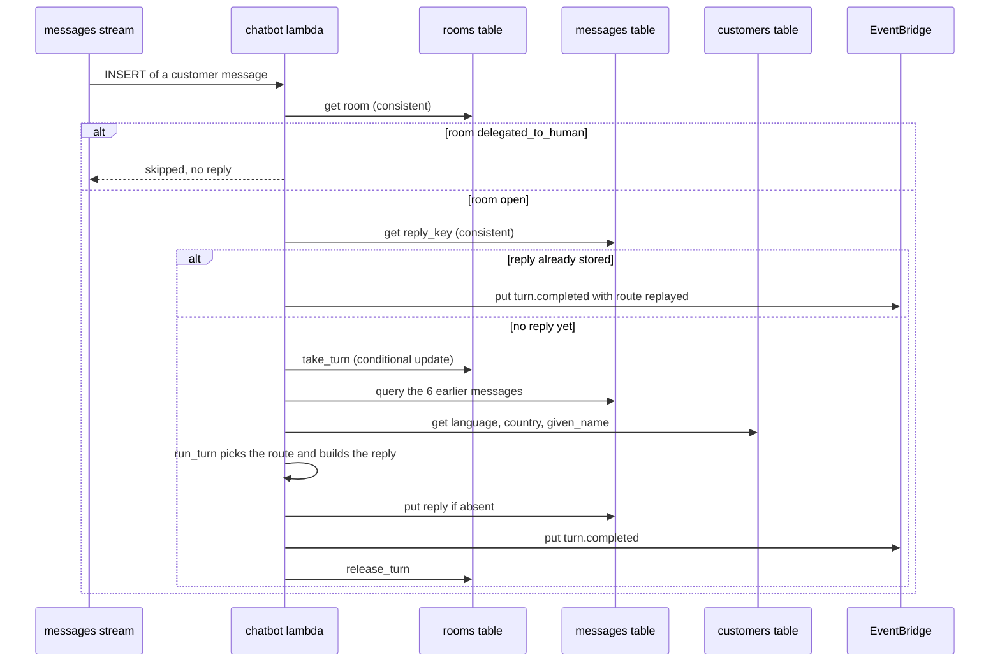

## Run the open mode graph

A free text, a pick without a purpose or a charge topic runs a LangGraph of `supervisor`, `tools`, `facts_check`, `fallback` and `finalize` in `core.graphs.open_mode`.
Only `supervisor` calls Bedrock, with the model profile of `BEDROCK_MODEL_ID` (`core.graphs.profiles.profile_for`), and every value the customer reads comes from a tool fact through `replies.compose`.

1. Before the graph, `run_turn` fills the `Ledger` with `list_cards` always, the 5 newest memories (`_memories` through `Memory.memories` and `tools.memory.remember_fact`), the stored read of a picked option (`choice.read`), the charge of a topic (`_charge` through `charge_facts`), and the target of an ask that stays open (`_kept`).
2. The closing ask is decided in code: a charge in focus gets `recognize_charge` or `was_it_you` from `rules.story_ask`, a kept ask stays, and an abstain hit gets `talk_to_person` with its reason.
   It travels in `OpenModeRun.closing` and `rules.TurnState`.
3. `core.graphs.prompt.Context` builds the system block (given name, locale, today, cards, last 3 exchanges, choice, memories, topic, story) after the cached system prompt.
4. `supervisor` calls Bedrock through `_invoke` with a tool choice of `any`, retrying once on throttling or unavailability, and forces `reply` on the last step or after 8 tool calls.
   The budgets are 4 model steps (`MAX_STEPS`), 12 seconds (`TURN_SECONDS`) and 40,000 input tokens (`INPUT_TOKEN_CAP`).
5. When the model calls tools, `tools` runs each through `core.tools.call` under the read-only session: `list_cards`, `card_status`, `search_movements`, `merchant_history`, `spend_summary`, `recurring_charges`, `charge_facts`, `case_status`, `recall` and `search_policies` (see Data: Search policies at runtime).
   Each round announces the family of its first tool (see Show turn progress).
   `prompt.shown_rows` shows the model at most 5 movement rows per result.
6. The model ends with one `reply` call carrying `say` or `say_key`, optionally a view, an ask, or an `answer`.
   `facts_check` validates it with `_checked`: an `answer` counts only when `TurnState.answerable` (an open `recognize_charge` without a question mark), a repeated `say_key` is an error, each say passes `tidy_reply` and `tidy`, a closing ask replaces the model's ask, a story ask outside `rules.allowed_asks` is dropped, an allowed `open_claim` becomes `have_card`, and `core.facts.check.check` verifies every reference.
7. A first check failure sends the errors back to `supervisor` as a repair message; a second failure, an exhausted budget, an unavailable model, a model message without a tool call or a crash goes to `fallback` (`run_open_mode` also catches crashes and counts `TurnsCrashed`).
8. `fallback_answer` builds a template from the last tool round (`fallback("answer")`) with source `fallback`.
9. `finalize` runs `replies.compose`: says with citations, views with readings, asks with labels and options, the closing ask in place of the model's.
10. Back in `run_turn`, an `answer` the model read for an open `recognize_charge` goes to `story.answered` with its writes marked `:graph`.
    An abstain hit whose reply fell back is replaced by the `abstain_*` template plus the `talk_to_person` ask.

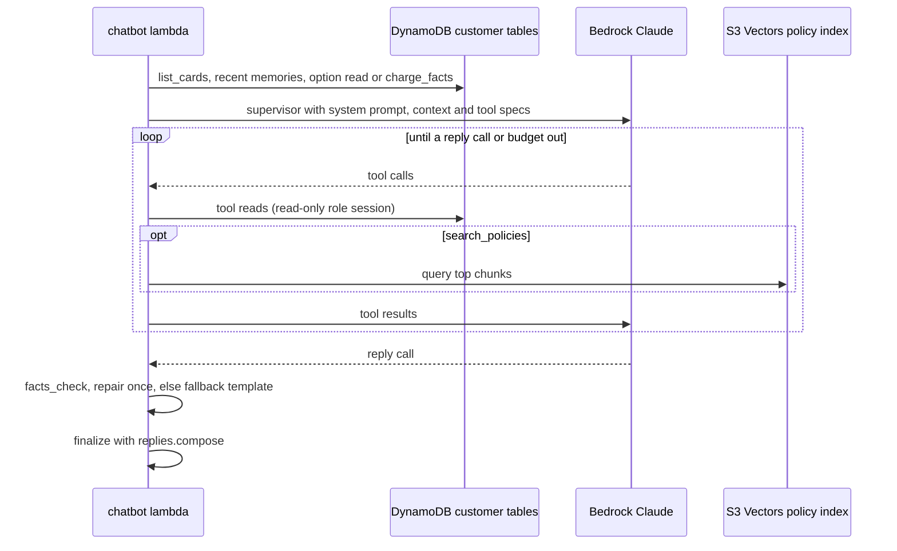

## Answer a charge question

A charge question is the story ask `recognize_charge` or `was_it_you`, shown with a charge view.
`rules.answer_of` reads the customer's answer from a tap (`ask_id` equals Clara's latest message and the option is valid), from the not me floor when the ask is about the charge, from a short yes or no (`router.short_answer`), or from the model (`graph`).

1. `core.turn.run_turn` calls `core.story.answered`, which routes to `_about_the_charge`.
2. Option `why` (only on `was_it_you`): `read_charge` reads the charge with `charge_facts`, the reply is the `why_asked` template composed by the model (see Compose a sentence with the model), the charge view and `was_it_you` again.
   Nothing is written.
3. Any other option calls `rules.close_ask`, then `rules.remember_answer`: it reads the transaction with `Accounts.transaction`, looks for an earlier answer with `Memory.of_charge`, and puts `recognized_charge#<transaction>` or `unrecognized_charge#<transaction>` in the `memory` table with `put_if_absent`, keyed by the transaction and carrying the `ask_id`, which tells `redelivered` from `already`.
   The outcome is `written`, `redelivered`, `already` or `missing`: `missing` answers the `unavailable` fallback, and `already` with a different earlier answer answers the fixed `already` text.
4. A yes answers the `recognized` template, composed by the model; `_learn_merchant` also puts `recognized_merchant#<merchant>` once 3 charges of that merchant are recognized.
5. A no goes to `story.protect` when the ask was `was_it_you`, when the answer came from the floor or the graph, or when `rules.protect_signals` finds a flagged score, a foreign country, an unusual channel or a declined status.
   Otherwise the reply is the fixed `have_card` text, the charge view and the `have_card` ask.
6. `story.protect` offers the block: an active card gets `consent_block`, the card view and the `block_card` ask; a blocked card gets `card_blocked_offer` and a `talk_to_person` ask.
7. A yes on `have_card` answers `consent_claim`, the charge view and `open_claim`; a no goes to `protect`.
8. The reply is composed with source `story`, carries the effect `charge_answered` when the memory row is written or redelivered, and `Turn.writes` records `memory`.

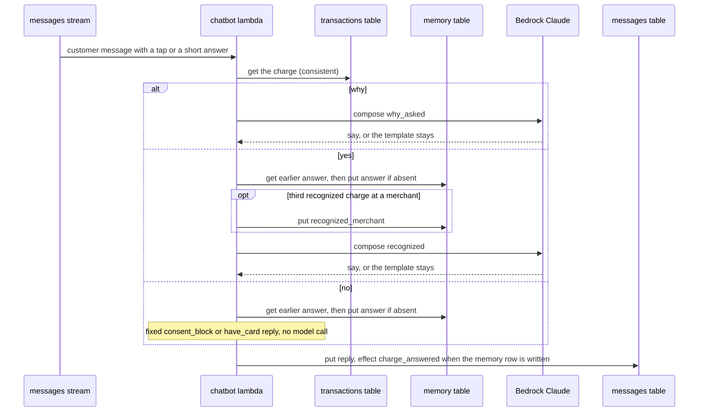

## Handle not me and lost or stolen

Wording such as "no fui yo" or "me robaron" is caught by `router.floor` on the raw text, before any model call, when the message carries no tap or topic.
The reply is built by `core.story`, with fixed texts and lists to pick from.

1. `run_turn` calls `story.not_me` for a not me hit and `story.lost` for lost or stolen.
2. `story.not_me`: with a charge in the open ask it goes to `protect` on that charge.
   With an open `block_card` ask it goes to `protect` on that card.
   Otherwise it reads `search_movements` (limit 5) and answers the fixed `not_me` text with a `which_one` ask over those movements and purpose `not_me`.
   Without movements it answers `answers.safety`, the bank's phone numbers from `policy_facts`.
3. `story.lost` reads `list_cards`.
   No cards answers `answers.safety`; no active card answers `lost_none`, the cards view and a `talk_to_person` ask (reason `lost`, area `fraud`); otherwise `lost`, the cards view and a `which_one` ask over up to 5 active cards with purpose `lost`.
4. The customer taps an option: `rules.resolve_choice` finds it in the stored `draft` of Clara's latest message and returns the option's `read` and `purpose`, so `run_turn` calls `story.picked`.
5. Purpose `lost`: `story.protect` on the picked card.
   Purpose `not_me`: `_charge_of_pick` reads the charge, `rules.remember_answer` puts `unrecognized_charge#<transaction>` in `memory`, keyed by the transaction and carrying the tap's `ask_id`, then `protect`.
   A written or redelivered answer adds the effect `charge_answered`.
6. `protect` ends in the `block_card` consent (see Block a card and hand off).

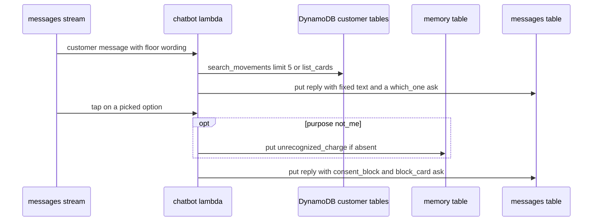

## Block a card and hand off

A yes on `block_card` blocks the card with the customer's consent, reads the result back, opens a case and writes its summary.
Each write is keyed by the `ask_id`, so a redelivery finds its own result and answers the same.

1. `rules.answer_of` accepts the tap only when its `ask_id` is the `block_card` message of Clara's latest reply; `story.answered` calls `_block`.
2. `card_fact` finds the card (`list_cards` when it is not in the ledger) and `read_charge` the charge when the ask has a transaction.
3. `Accounts.block` updates the `products` row to `Blocked` with `blocked_by` set to the `ask_id`, only if it is `Active`.
   On a failed condition it reads the row consistently: `redelivered` when `blocked_by` matches, `already` when blocked otherwise, `inactive` or `missing`.
4. `Accounts.read_status` reads the status back consistently.
   `Blocked` with `written` or `redelivered` gives the `blocked` receipt and the effect `card_blocked`; `Blocked` with `already` gives `blocked_before`; anything else gives `block_unconfirmed` and no claim of success.
5. `_hand_off` calls `Cases.open` with `complaint_id` equal to the `ask_id`, kind `fraud`, and evidence (`room_id`, `ask_id`, `message_id`, transaction): a conditional put, then a consistent read that must match the area and transaction (see Cases: Open a case).
   A case that cannot be read back answers `case_unconfirmed` with the bank's phone.
6. `handoff.Package` and `handoff.points` list the request, the charge or card, what the bank noticed, the customer's note and the block outcome.
7. `summarize` composes the summary with the model (key `summary`, see Compose a sentence with the model) or falls back to `handoff.summary_template`, and `Cases.write_summary` stores it once with `summary_points`, language, time and source (`compose` or `template`).
8. The reply is the block receipt, the `case_opened` receipt and the case view, with effects `card_blocked` and `case_opened`; `Turn.writes` lists `block`, `case` and `summary` as they were written.
9. A no (`Ahora no`) answers the `declined_block` template and writes nothing.
   After the receipt, a second tap is no longer an answer to Clara's latest reply, so it runs as an open mode message and writes nothing.

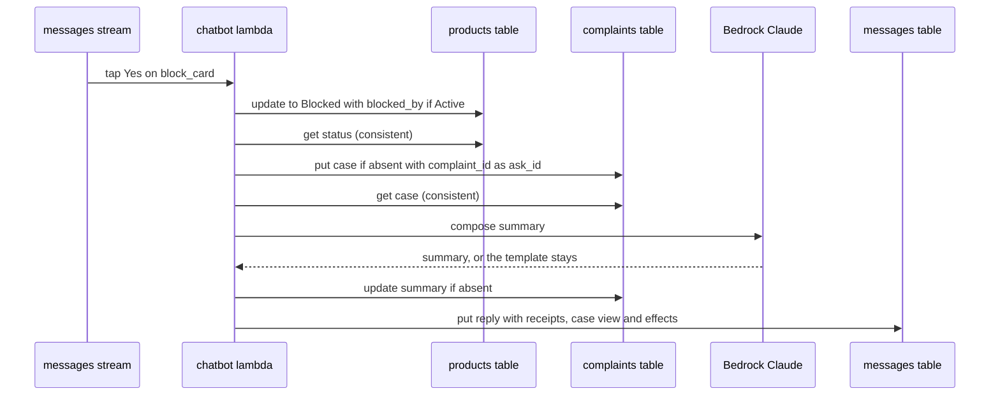

## Open a claim or hand off to a person

Two more story asks write a case without blocking anything: `open_claim` for a charge the customer does not recognize while holding the card, and `talk_to_person` for what only the bank can do.

1. `have_card` yes leads to `consent_claim`, the charge view and `open_claim` (see Answer a charge question).
2. `open_claim` yes: `story.answered` reads the charge and calls `_hand_off` with kind `claim` and the card of the charge; the receipt is `claim_opened`.
   No block is attempted.
3. `talk_to_person` yes calls `_person`.
   An ask with area `fraud` opens a `fraud` case (request `not_me` with a charge, `lost` without, block outcome `blocked_before` when the card is already blocked).
   Any other ask opens a `service` case whose request is the target's reason (`unblock`, `refund`, `human`) or `other`, optionally about an existing case read with `case_status`.
4. `_hand_off` then runs as in Block a card and hand off: `Cases.open` keyed by the `ask_id`, the package, the summary, `Cases.write_summary`, the case receipt and view, and the effect `case_opened`.
5. A `talk_to_person` ask comes from `router.abstain` (unblock, refund, talk to a person) as the closing ask of an open mode turn, from `protect` for an already blocked card, from `story.lost` without an active card, or from the model through `rules.allowed_asks`.
6. A no on `open_claim` or `talk_to_person` answers `declined_claim` or `declined_person` and writes nothing.

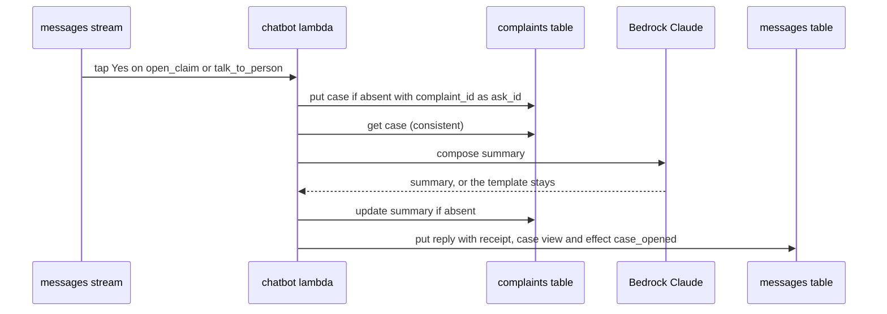

## Compose a sentence with the model

Story replies are fixed texts, except a few sentences the model words from facts: `recognized`, `why_asked`, `declined_block`, `declined_claim`, `declined_person` and the case `summary`.
`core.graphs.compose` runs a small LangGraph of `compose`, `facts_check`, `fallback` and `finalize`, and a failure never fails the turn: the template stays.

1. `core.turn._composed` (or `summarize` for the summary) builds a `ComposeRun` with the step key, the template as the example, the fact ids and, for the summary, the points and the customer's last messages.
2. `compose` calls Bedrock with the `compose.v1` prompt and a forced `say` tool (1 or 2 paragraphs of at most 600 characters), within 3 seconds (`COMPOSE_SECONDS`).
3. `facts_check` runs `tidy` and `core.facts.check.check` on the says; for the summary it also rejects any `verdict.reasons` reference, which speaks to the customer.
4. A time out, model error, malformed call or failed check goes to `fallback`, which keeps the template.
   Otherwise the model's says replace the template's.

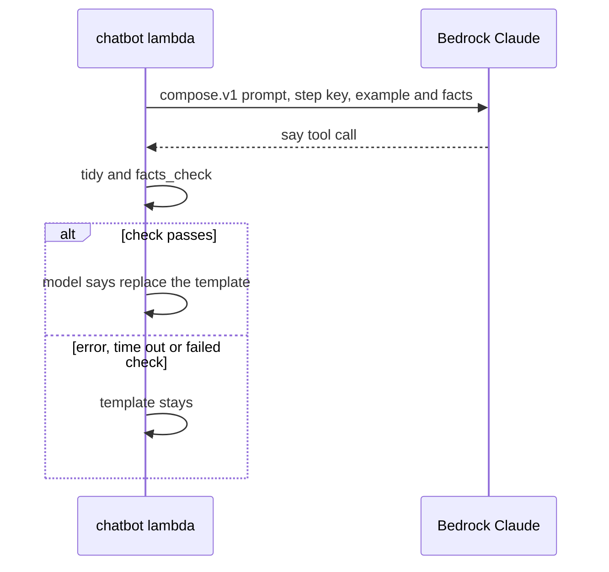

## Show turn progress

While tools run, the chatbot publishes a status event so the customer sees what Clara is looking at.
The event is best effort: it never delays or fails the turn.

1. In the `tools` node, `_announce` calls `on_status` with the `family` of the first tool of the round (`cards`, `movements`, `cases`, `memory` or `policies`) and the round number.
2. `chatbot.handler._status` builds `{type: status, id: <message_id>#<round>, room_id, message_id, round, status}`.
3. `Messaging.mark_status` sets `turn_status` on the room, conditional on the turn mark of this message; this is what a reload reads.
4. `core.realtime.Publisher.publish` posts the event to AppSync Events over HTTP signed with SigV4, on the channel from `room_channel` (`/<namespace>/<customer_id>/<room_id>`), with a 0.5 second timeout and no retries.
5. A failure is logged as `status not published` and the turn continues.
6. In the app, `subscribeToRooms` hands the event to `isStatusEvent` and the reducer keeps it only for the customer's last message and a round not older than the current one; `liveTurn` holds it for 30 seconds and `useStatusText` maps the family to the text shown while Clara works.

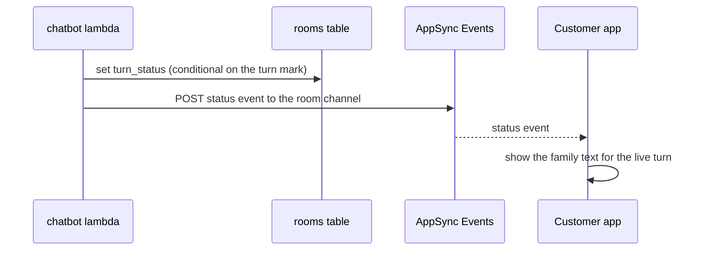

## Emit turn events

Every completed turn, replayed ones included, leaves one `turn.completed` event for analysis.

1. `chatbot.handler._turn_completed` calls `put_events` on the bus named by `EVENT_BUS_NAME` with source `clara.chatbot` (`EVENT_SOURCE`) and detail type `turn.completed`.
2. The detail holds `customer_id`, `room_id`, `message_id`, `reply_message_id`, the X-Ray `trace_id` and `Turn.summary()`: route, model, prompt, cost in USD, floor, locale, source, duration, steps, timings, tool calls, tokens, the check result with errors and tidied counts, why the budget ran out, writes and effect types.
   A replay carries only the route `replayed` and the stored source.
3. A rejected entry raises `TurnEventRejected`, the record fails and the retry replays the stored reply and emits again.
4. The bus rule `<prefix>-turns` matches the source and targets the Firehose stream `<prefix>-turn-events`, which buffers and delivers gzip files to the events S3 bucket under `turns/<yyyy>/<MM>/<dd>/`.

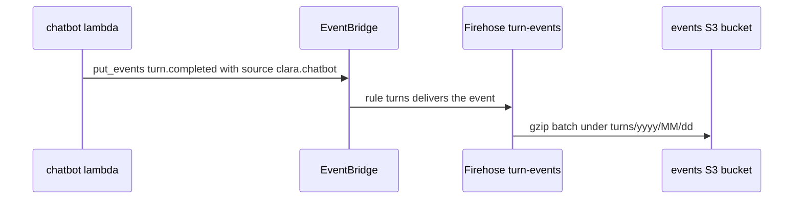

## Set up the demo account

A new customer picks a country and language once, and the crud lambda generates a deterministic bank account for them.
`crud.handler.complete_setup` is safe to repeat: the setup claim fixes the country and the anchor time, so a retry regenerates the same data.

1. The app shows `SetupFlow` while `profile.setup_completed` is false: country (default from `guessCountry(navigator.languages)`) and language (the current locale).
   Submit runs the `bankQueries.setup` mutation, which calls `bank.setup`: `POST /crud/profile/setup` with `{country, language}` through `createHttp` (id token as `Authorization`, retried on 429, 5xx and network errors).
2. The API Gateway Cognito authorizer passes the claims to `crud.handler`; `_customer` accepts only the customers pool.
3. `country` must be in `crud.catalog.COUNTRIES` and `language` in `LANGUAGES`, else 400.
4. `Store.claim_setup` updates the `customers` row with country, language and `setup_claimed_at`, conditional on the row existing and no earlier claim.
   An earlier claim is read back and reused; a completed setup raises `SetupAlreadyCompleted` and answers 409; a missing customer answers 404.
5. `crud.generator.generate` builds the account from a seed of customer id and anchor: 3 cards, 100 transactions each over 90 days, 3 planted cases (`fresh_hold`, `reversed_charge`, `stale_pending`) and a seeded claim on an approved point-of-sale charge older than 7 days (`seeded_claim`).
6. `core.ingestion.check` validates every transaction against the contract and the card currency.
7. `Store.write_account` puts the cards in `products` and batch-writes the transactions in `transactions`; `Store.write_claim` puts the seeded claim in `complaints` if absent.
8. `Store.complete_setup` sets `setup_completed_at` once, and the lambda answers 201 with `{profile, cases}` and counts `SetupsCompleted`.
9. In the app, `onSuccess` stores the profile and invalidates cards and cases; a 409 falls back to fetching the profile with no cases.
   `PlantedCasesGuide` lists the planted cases when present, and `applyProfileLanguage` sets the locale.

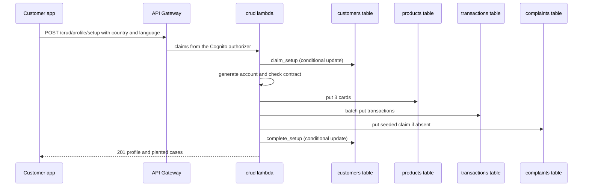

## Add a transaction

The demo footer adds a normal or a suspicious transaction to a card, so a tester can trigger Clara's flows on demand.

1. The app's `AddLinks` calls the `bankQueries.add` mutation with a `transaction_id` minted by `mintId(clock)` (a UUIDv7 from the server-synced clock) and `type` `normal`, or `suspicious` with a score option (`flagged`, `missed`, `none`).
   `onMutate` puts a pending placeholder in the ledger cache; `bank.add` sends `POST /crud/cards/{product_id}/transactions`.
2. `crud.handler.add_transaction` checks `type`, `score` (default `missed`) and that the `transaction_id` is a UUIDv7 within 2 minutes of server time (`MAX_CLOCK_SKEW`), else 400.
3. `Accounts.card` confirms the card is the customer's (404 otherwise) and `Accounts.transaction` returns an already stored transaction with 200, which makes the call idempotent.
4. `Store.claim` reads the setup claim for the country and anchor; a missing customer answers 404 and a setup not started answers 409.
5. `generator.manual_transaction` draws a random merchant of the country with a low score for `normal`.
   For `suspicious` it draws an online merchant with a 4-digit suffix reserved by `Store.reserve_suspicious_suffix` (up to 20 draws, then 503), channel `Web`, the home city and the chosen score.
6. `Ingestion.accept` validates the contract and currency, then runs one `transact_write_items`: put the transaction if absent and, when it is `Approved`, move the card balance (debit needs funds, credit respects the limit).
   A lost condition on the put returns the stored transaction with 200; a refused balance move answers 400.
7. The lambda answers 201 with the transaction and counts `TransactionsAdded`.
8. In the app, `onSuccess` swaps the placeholder for the stored row, `onError` removes it, and `onSettled` invalidates the ledger and, after the last pending add, the cards (balances).

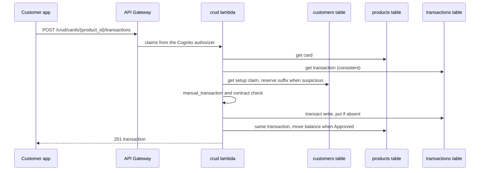

## Read the account

The bank screens and Clara's panels read the customer's profile, cards, ledger and answered charges through the crud lambda.
Listing cases belongs to Cases (see Cases: Customer app reads cases).

1. `createHttp.request` sends each call with the id token and retries 429, 5xx and network errors after 400, 1200 and 3000 ms.
2. `crud.handler._customer` builds the principal from the authorizer claims and requires the customers pool; each route reads through `core.access.customer_session`, a role session scoped to that customer.
3. `GET /crud/profile`: `read_customer` and `_profile` return country, language, `setup_completed`, `given_name` and the bank's phone from `policy_facts`.
4. `GET /crud/cards`: `Accounts.cards`.
5. `GET /crud/cards/{product_id}`: `Accounts.card` plus `Accounts.newest_transactions`, 20 per page, newest first, consistent.
   `next_cursor` is an opaque `encode_cursor` value bound to the card (a foreign cursor answers 400), and `server_time` lets the app sync its clock.
6. `GET /crud/cards/{product_id}/transactions/{transaction_id}`: `Accounts.transaction`, 404 when absent.
7. `GET /crud/memory/charges`: `Memory.answered` returns the transaction ids the customer recognized or did not recognize, up to 500.
8. The app caches them under `bankKeys`: profile and cards for 5 minutes, ledger, transaction, cases and answered for 30 seconds.
   The home route loads cards, then every card's ledger; the Clara widget counts `flaggedCharges` (score above 30, not pending, card not blocked, not answered, no case) for its badge.

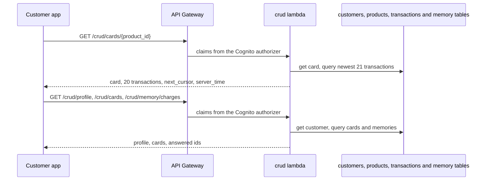

## Sign in and load the app

The customer app signs the customer in with Cognito and loads the profile before it renders any bank screen (see Identity: Sign up a customer and Sign in for the account side).

1. `SignInPage` calls Amplify `signIn` with email and password.
   `CONFIRM_SIGN_UP` calls `resendSignUpCode` and goes to `/verify`; `DONE` goes to `/`; any other step is an error.
2. `onlySignedOut` guards `/sign-in`, `/sign-up` and `/verify`: a signed-in visitor goes to `/`; a signed-out one clears the query cache, `forgetClara()` removes every `clara.session.v1.` key and the locale resets to the signed-out one.
3. The `app` route `beforeLoad` calls `getCurrentUser` (no user redirects to `/sign-in`) and `claraSession.open(customerId)`, which scopes the session storage key to the customer.
4. Its loader runs `ensureQueryData(bankQueries.profile())` (see Read the account) and `applyProfileLanguage`: the profile language, else the `locale` claim of the id token.
5. `AppLayout` renders the screens, `SetupFlow` while setup is incomplete (see Set up the demo account) and, off `/chat`, the `ClaraWidget`.
6. Sign out calls `signOut`, `router.clearCache` and goes to `/sign-in`.

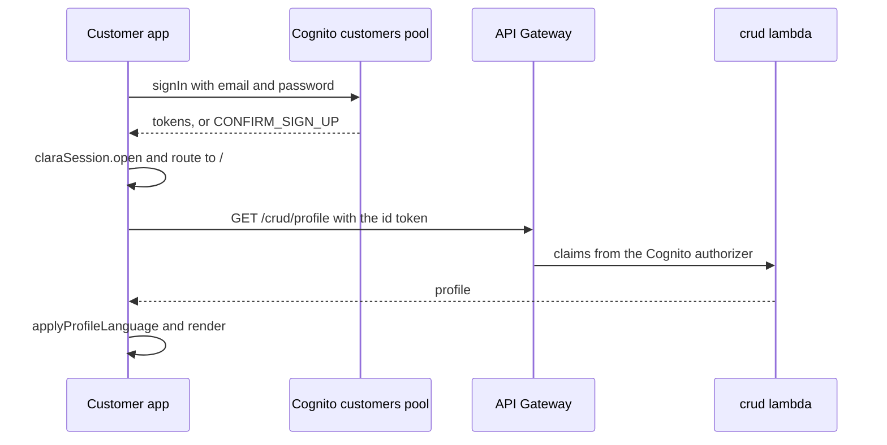

## Chat with Clara in the app

The chat screen subscribes to the room channel first, loads the latest room second, and merges everything by message id, so a reply is never lost between the two.

1. `/chat` renders `ClaraChatPage`, which runs `useLiveChat` over `useChat(customerId)`.
2. `useChat` opens `subscribeToRooms`: `events.connect` on `/<realtimeNamespace>/<customerId>/*` of AppSync Events, waiting for `subscription.ready` (see Messaging: Authorize a room subscription).
3. It then calls `api.latestRoom` (`GET /messages/rooms/latest`, see Messaging: Open the chat), syncs the clock from `server_time` and dispatches `loaded` with the room, its messages and the turn mark.
4. A topic left in `claraSession` is taken once the chat is loaded and sent as a message (see Open Clara from the bank app).
5. Sending mints a message id, and a room id when there is none, shows a pending message and calls `api.send` (`POST /messages`, see Messaging: Send a message); `confirmed` or `failed` follows, and a retry within 90 seconds reuses the id, later ones mint a new id (see Messaging: Retry a failed send).
6. Choosing an option on Clara's latest ask calls `choice`: the text is the option label (and note) and `input` is `{ask_id: <Clara's message id>, option, note?}` with the note at most 140 characters.
7. Room events arrive on the subscription: a message (`isServerMessage`) is dispatched as `received`, its `parts` read as says with citations, one view and one ask, and its `effects` kept; a status event updates the live turn (see Show turn progress).
8. The chat shows Clara as working while the last message is the customer's and under 30 seconds old (`THINKING_CAP_MS`), or a live status exists.

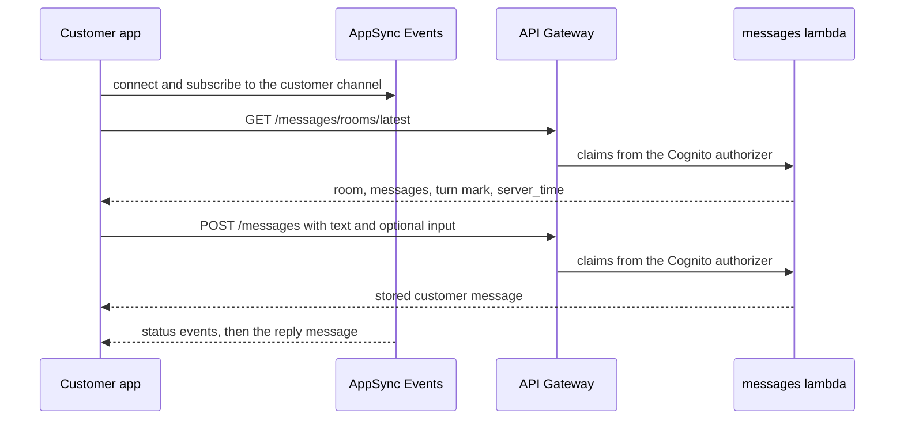

## Catch up after a connection drop

When the subscription breaks or the page comes back, the chat reconnects and reloads the room, which restores anything missed.

1. `watchReturn` calls `reconnect` when the page turns visible after being hidden and on the browser `online` event.
2. A subscription `onError` calls `retryLater`, which waits `retryDelay(failures)` (1 second doubling up to 30 seconds) before `reconnect`.
3. `reconnect` bumps `attempt`, which reruns the open effect: it closes the old subscription, subscribes again and calls `api.latestRoom`.
4. The reload dispatches `loaded`: messages merge by id, the turn mark is kept when it belongs to the same message, failures reset and the `chat.reconnecting` notice clears.
5. A failed load shows the `chat.loadFailed` notice and `reload` repeats the load.

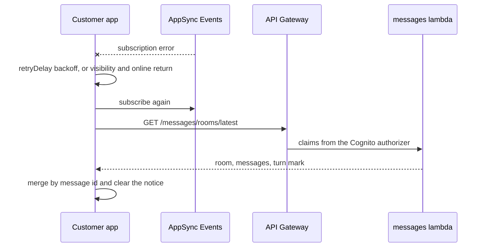

## Refresh the app after a reply

A reply's `effects` tell the app which cached data its writes made stale, so the bank screens show the block, the case or the answered charge without a reload.

1. Story replies carry effects from `core.story`: `card_blocked` with `product_id`, `case_opened` with `complaint_id` and `case_type`, `charge_answered` with `transaction_id`.
2. `useLiveChat` goes through the messages once per `messageId` (a `Set` in a ref, so loaded history is applied once too) and calls `invalidationsOf` from `bank/queries.ts`.
3. `card_blocked` invalidates the cards and that card's ledger, `case_opened` the cases, and `charge_answered` the answered charges, each with `exact: true`.
4. Active queries refetch (see Read the account and Cases: Customer app reads cases), and the Clara badge, card states and claim pills update.

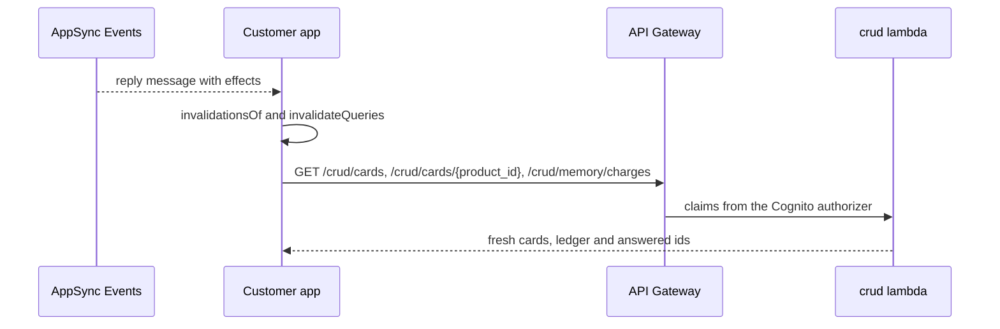

## Open Clara from the bank app

The bank app is the protagonist and Clara a widget: the customer reaches the chat from several places, each leaving an optional topic that becomes the first message.

1. `ClaraWidget` shows the floating button with the count of `flaggedCharges`; a click calls `launcher.open` and `Launcher` shows the newest flagged charge and any open claim.
2. Entry points call `useOpenClara`: the launcher (a typed text, the flagged charge, unrecognized charges, cards, the open claim, or the plain chat), the transaction sheet (`chargeTopic`) and the case sheet (claim topic).
   `claraSession.startTopic` saves the topic in `sessionStorage` under the customer's key and the router goes to `/chat`.
3. Once the chat is loaded, `takeTopic` clears it and sends `topicMessage` (localized text) with `topicInput`.
   Only a `charge` topic carries `input: {topic: {type: charge, product_id, transaction_id}}`; the others are text only.
4. `core.messaging.structured` accepts a topic only with exactly `type`, `product_id` and `transaction_id`, the last two UUIDv7.
5. On the stream, `rules.topic_of` routes the turn to `topic`: `_charge` reads the charge with `charge_facts` and keeps it only when it belongs to that card, `rules.story_ask` sets the closing ask, and the open mode graph answers around it (see Run the open mode graph).

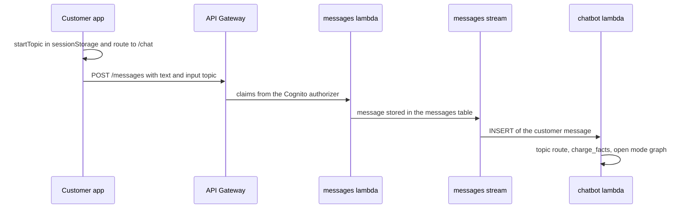
