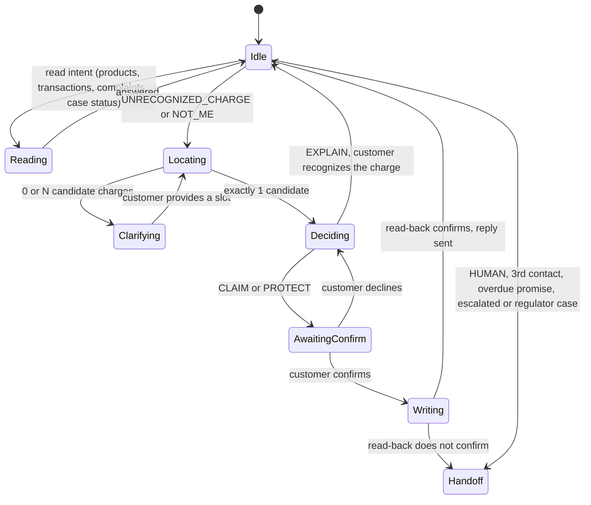
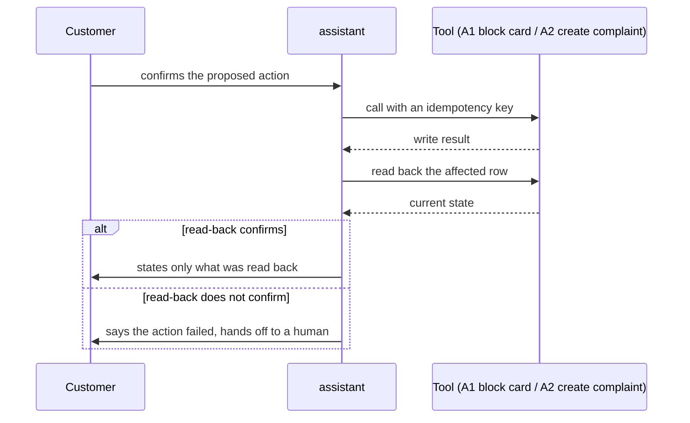

# assistant: flows

Status: designed, not built.
Full detail (the intent list, the policy table, the tool table) lives in `docs/tasks/_drafts/turn_flow.md` at the docs repo root; this page only carries the two diagrams that explain the shape of one turn.

## One turn

Runs once per customer message: it decides where the conversation stands, then whether to explain, ask, claim, protect or hand off.

Source: `docs/tasks/_drafts/turn_flow.md` (state machine), simplified to the states this module owns; every arrow is a rule, none is chosen by a model.

## Writing an action: confirm, then read back

Only `CLAIM` and `PROTECT` reach a write, and the customer never hears "done" before the write is read back.
Customer login is Cognito email and password; there is no OTP inside the chat, only explicit confirmation before the write.

Source: `docs/product/02-technical-flows.md`, "Writes with confirmation and read-back"; `docs/tasks/_drafts/turn_flow.md`, step 10.
A retry with the same idempotency key never blocks a card or opens a case twice.
