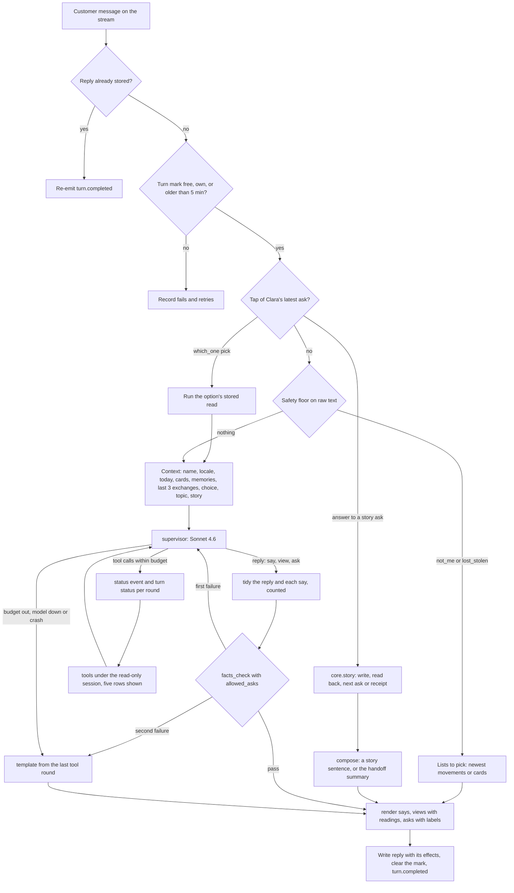
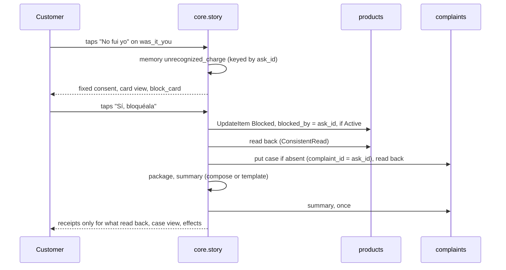

# assistant: flows

Status: the open-mode turn (tasks 0019, 0020) and the story path with its writes (task 0022) are built.
The full design is `docs/tasks/_drafts/chat_architecture.md` at the docs root.

## One turn

Only `supervisor` and `compose` call the model; every other box is code, and every value the customer reads comes from a tool's facts through `render`. A free text with a story ask open is answered by the graph and the same ask is shown again; the rules, not the model, attach the bank's question after a charge is pointed at.

## A flagged charge, to the handoff

A redelivered confirmation finds its own `blocked_by`, case and summary and answers the same; a second tap is no longer an answer to Clara's latest message and writes nothing.
