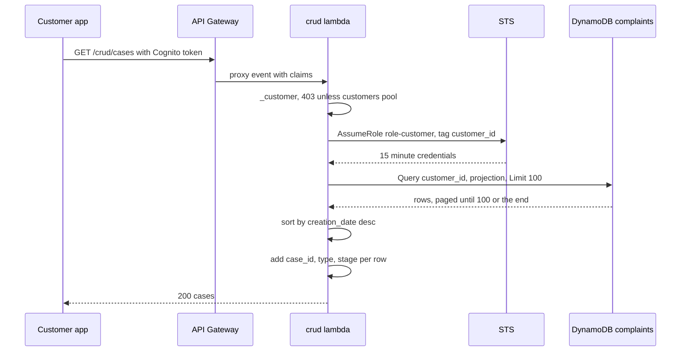
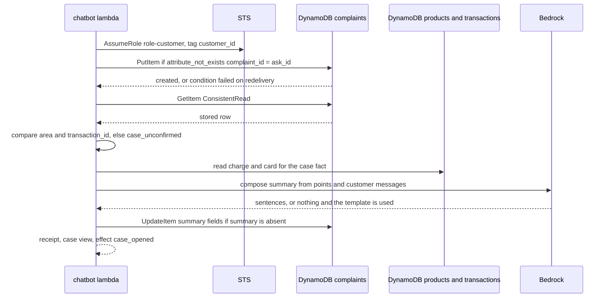
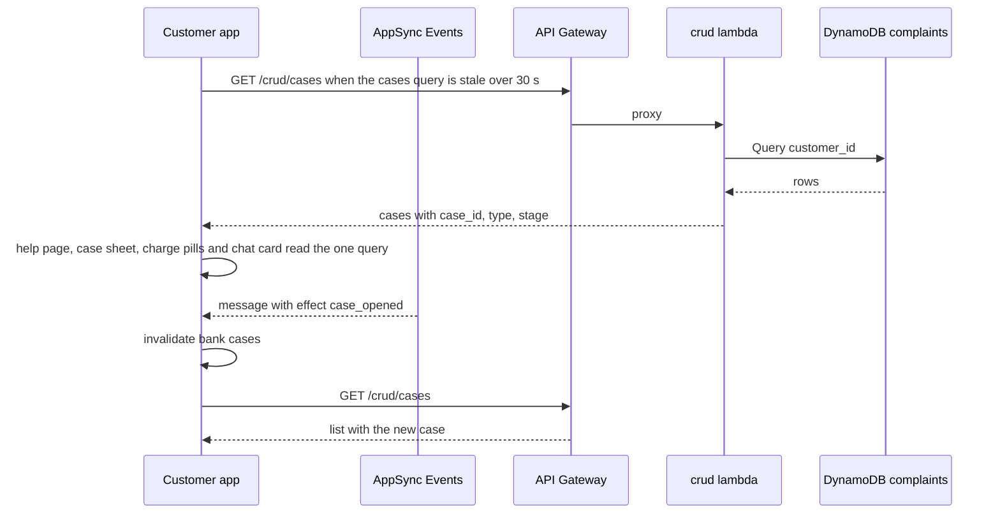

# Cases: flows

## Read the customer's cases

`GET /crud/cases` returns every case of the signed-in customer, newest first, with the stage the customer sees.
The lifecycle beyond `Open` is not a flow of the product: the read only maps whatever `status` the row carries.

1. The app calls `GET /crud/cases` with the customer's Cognito token; API Gateway authorizes it against the customers and staff pools and proxies `crud/{proxy+}` to the crud lambda (`infra/stacks/backend/api.tf`).
2. `list_cases` in `lambdas/crud/src/crud/handler.py` calls `_customer`, which builds a `Principal` from the claims and answers 403 unless the token is from the customers pool.
3. `customer_session` in `lambdas/core/src/core/access.py` assumes `ROLE_CUSTOMER_ARN` through STS with the session tag `customer_id`, so the DynamoDB client can only touch that customer's rows.
4. `Cases.cases` in `lambdas/core/src/core/cases.py` queries the `complaints` table by `customer_id` with a projection of `COMPLAINT_ATTRIBUTES`, at most `MAX_CASES` (100) rows, following `LastEvaluatedKey` until the limit or the end.
5. `public_case` keeps only the allow-listed attributes (dates, `area`, `status`, `transaction_id`, `product_id`, the five summary fields) and turns decimals into strings; `evidence` and every other attribute never leave the table.
6. `list_cases` sorts the rows by `creation_date`, newest first, and `_case` adds three fields to each row.
   - `case_id`: `case_code`, an FNV-1a hash of `complaint_id` shaped `CLR-YYYY-NNNNNN`, computed on every read and never stored.
   - `type`: `case_type` maps `area` (`fraud`, `claims`, `service`) to `fraud`, `claim`, `service`, and any other area to `claim`.
   - `stage`: `stage` maps `status`: `Open`, a missing or an unknown status give `assigned` when `assignment_date` is set and `opened` otherwise; `In Process` and `Escalated` give `in_review`; `Resolved` and `Rejected` give `resolved`; `Closed` gives `closed`.
7. The response is `{"cases": [...]}`.
   The demo claim planted by `POST /crud/profile/setup` (`seeded_claim` in `lambdas/crud/src/crud/generator.py`) is stored as `In Process` with its dates, so it reads as `in_review`.

## Open a case

A confirming tap writes one case row, keyed by the ask the customer confirmed, then a summary for the person who will take it.
The chatbot turn that reaches this step is not described here, see Assistant: Block a card and hand off.

1. `_hand_off` in `lambdas/core/src/core/story.py` runs inside the chatbot lambda for a block, a claim or a person ask, with the `OpenAsk` that was confirmed.
2. It builds `evidence` from the message: `room_id`, `ask_id`, `message_id`, and `transaction_id` when the ask targets a charge.
3. `Cases.open` in `lambdas/core/src/core/cases.py` builds the row: `customer_id`, `complaint_id` equal to the `ask_id`, `case_type` (`fraud`, `claim` or `service`), `area` from `AREAS`, `reception_channel` `clara`, `status` `Open`, `creation_date`, optional `product_id` and `transaction_id`, and `evidence`.
4. `Cases.write_if_absent` calls `put_if_absent` in `lambdas/core/src/core/conditional.py`: a `PutItem` with `attribute_not_exists(complaint_id)`.
   A redelivered or double-tapped confirmation fails the condition and `created` is false.
5. `Cases.case` reads the row back with `ConsistentRead`.
   If it is missing, or its `area` or `transaction_id` differ from what was asked, `open` returns `None`, `_hand_off` answers with the `case_unconfirmed` text with the bank's contact, and nothing else is written.
6. `case_fields` in `lambdas/core/src/core/tools/cases.py` turns the stored row into a `case` fact in the turn's ledger, reading the disputed charge and card for merchant, amount and last four digits.
7. `points` in `lambdas/core/src/core/handoff.py` builds the summary points from the `Package` (request, charge, card, block outcome, the open question), and `rendered` fills them from the ledger.
8. `summarize` in `lambdas/core/src/core/turn.py` runs `run_compose` with key `summary` against Bedrock (`lambdas/core/src/core/graphs/compose.py`).
   If compose says nothing, the template from `summary_template` is used; `summary_source` is `compose` or `template`.
9. `Cases.write_summary` runs an `UpdateItem` setting `summary`, `summary_points`, `summary_language`, `summary_generated_at` and `summary_source`, with the condition `attribute_exists(complaint_id) AND attribute_not_exists(summary)`, so the summary is written once.
10. The step answers with the `case_opened` receipt (`claim_opened` for a claim), a `case` view and the effect `{"type": "case_opened", "complaint_id", "case_type"}`; `writes` lists `case` when the put created the row and `summary` when the update applied.

## Customer app reads cases

The app holds one query for the list and derives everything it shows from it: the help page, the case sheet, the pills on charges and the case card inside the chat.

1. `bank.cases()` in `apps/customer/src/bank/api.ts` calls `GET /crud/cases`; `bankQueries.cases()` in `apps/customer/src/bank/queries.ts` caches it under `["bank", "cases"]` with a 30 second stale time.
2. The `/help` route loader in `apps/customer/src/router.tsx` runs `ensureQueryData(bankQueries.cases())`, so `HelpPage` in `apps/customer/src/bank/help-page.tsx` reads it with `useSuspenseQuery`.
3. `HelpPage` lists the cases where `isOpen` in `apps/customer/src/bank/cases.ts` holds (stage before `resolved`); each `CaseRow` shows the charge, the label of `stepOf` and `case_id`.
   Choosing a row sets `?claim=<case_id>` and `CaseSheet` in `apps/customer/src/bank/case-sheet.tsx` opens for the case with that `case_id`.
4. `CaseSheet` renders `stepsOf`: four steps (`opened`, `assigned`, `review`, `resolved`) from the stage, each with its date from `creation_date`, `assignment_date`, `first_response_date` and `resolution_date` or `closing_date`; `stageKey` picks the text, with a per-type text for `assigned` when the case is not a claim.
   The merchant and amount come from `useRow(chargeOf(item))`, the transaction read of the case's `product_id` and `transaction_id`.
5. The button "Ask Clara" calls `openClara` with `kind: "claim"` and the `case_id`.
6. Other surfaces read the same query: `caseOfTransaction` marks a charge as in a claim on the home page, the card page, the transaction sheet and the chat; `Widget` in `apps/customer/src/clara/widget.tsx` looks for the open claim for the launcher; the chat `CaseCard` in `apps/customer/src/clara/chat/views.tsx` shows the timeline and, when `summary_points` exist, what the bank already knows.
7. The list refreshes in two ways: `invalidationsOf` in `apps/customer/src/bank/queries.ts` maps the `case_opened` effect of a chat message to `bankKeys.cases()` (applied in `apps/customer/src/chat/live.ts`), and the setup mutation invalidates it on success.

