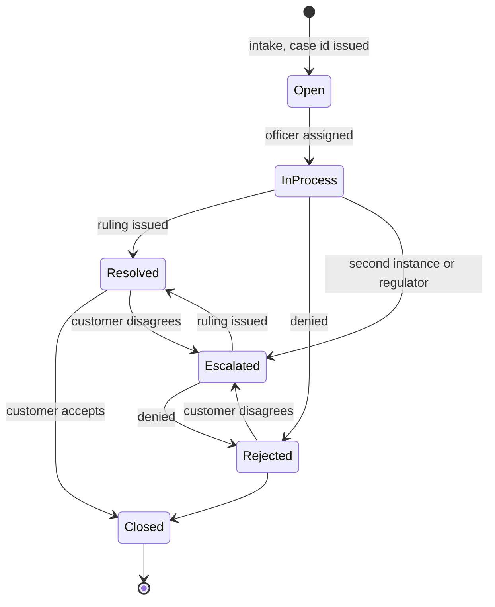
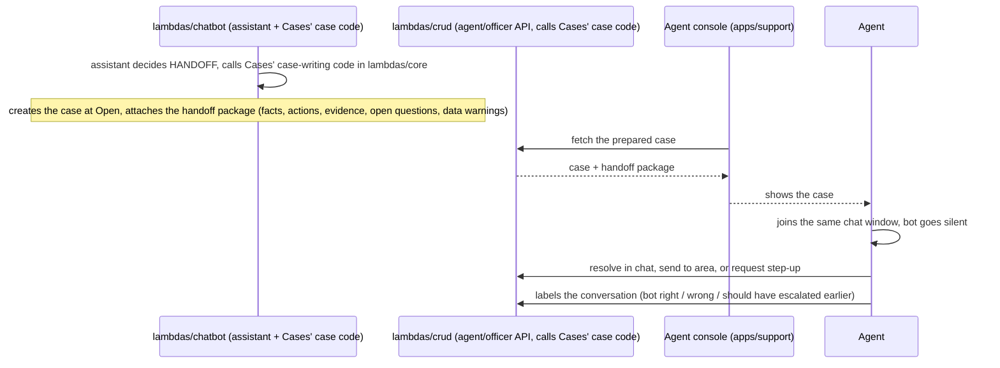

# Cases: flows

Status: designed, not built.

## Case lifecycle

Cases creates the `Open` state only; every later transition is human, read but not written by this module (`hackathon/docs/domain/dispute-process.md`).

## Handoff to the agent console

When the assistant decides `HANDOFF` (or an immediate `CLAIM`/`PROTECT` needs a human), it writes the case and the package through cases' own code, in-process, no lambda-to-lambda call; the agent console shows it and the agent takes over the same chat (`docs/product/01-flows.md` flow 2, `docs/product/02-technical-flows.md` black box A).

