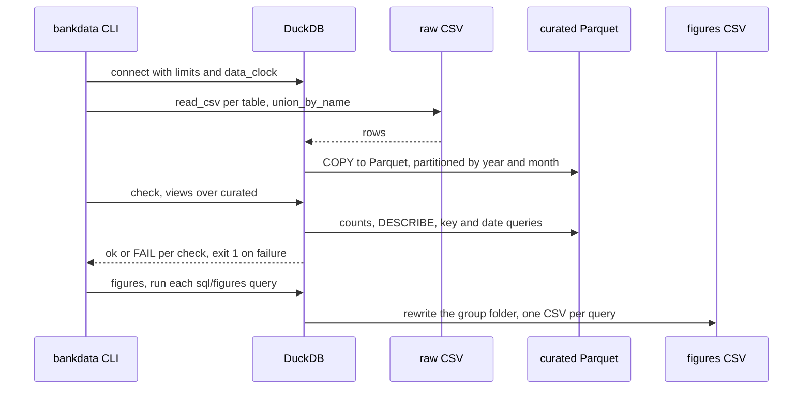
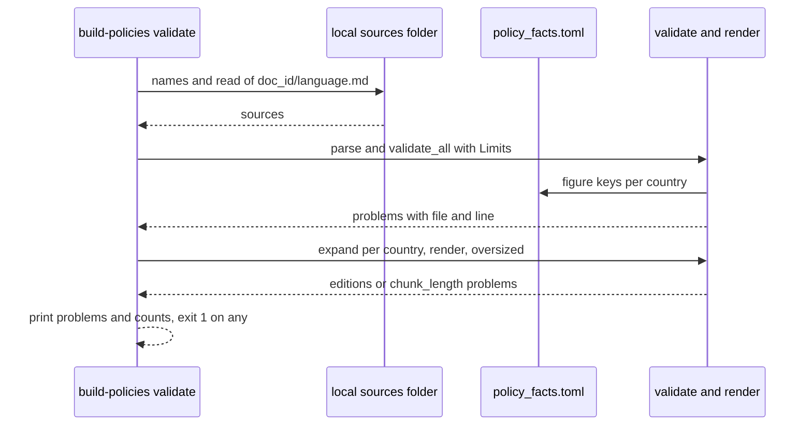
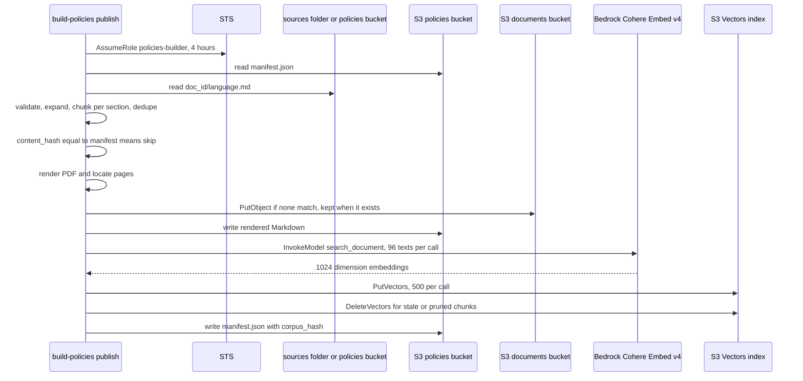
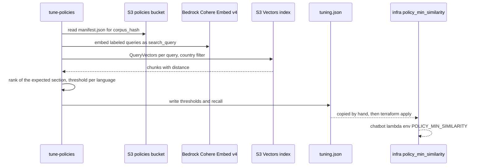
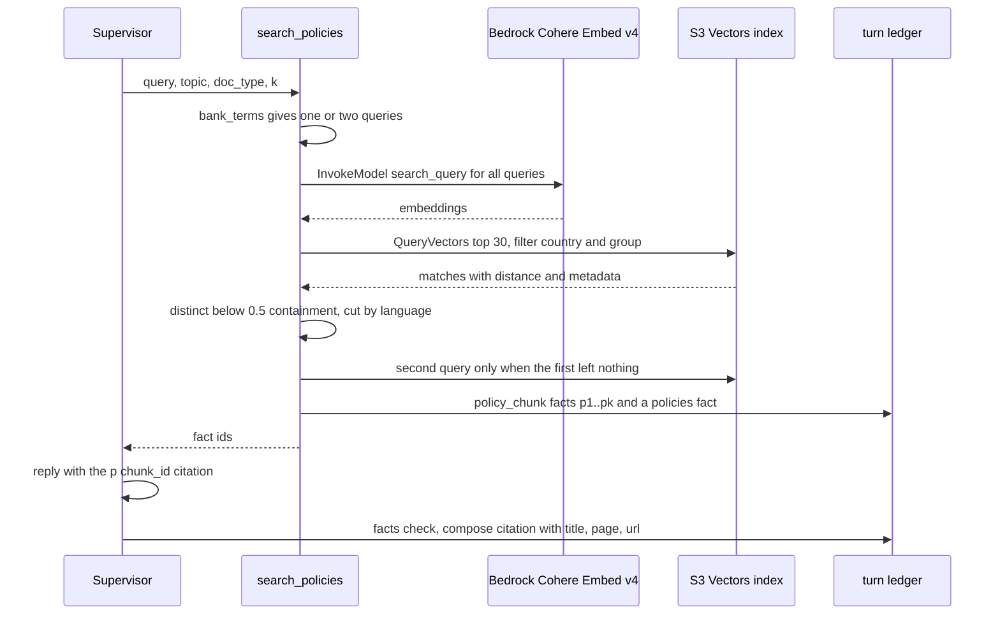

# Data: flows

## Dataset pipeline

Raw CSV of the bank dataset becomes curated Parquet, a contract check guards it, and the figure queries rerun on top.
The runtime does not read any of it.

1. `bankdata ingest [tables]` (`ingest` in `data/src/bankdata/cli.py`) loads `settings.load()`, which reads `BANKDATA_ROOT` (a local folder or `s3://bucket`) and the DuckDB limits.
2. `connect` in `data/src/bankdata/duck.py` opens DuckDB with the memory and thread limits, the `data_clock` variable (`2026-06-18`), and, for an S3 root, `httpfs` with the AWS credential chain.
3. `ingest` in `data/src/bankdata/pipeline/ingest.py` walks `TABLES` from `data/src/bankdata/pipeline/schemas.py`.
   For each table it empties the target (local roots only), then runs one `COPY`.
   - Partitioned tables: `read_csv` of `<root>/raw/<table>/*/*/*/*.csv` with hive `year`, `month`, `day`, written to `<root>/curated/<table>` partitioned by `year` and `month`.
   - Dimensions: `read_csv` of `<root>/raw/<table>.csv`, written to `<table>.parquet`.
4. The command prints the row count of each curated table.
5. `bankdata check [tables]` registers every curated table as a view and runs `check` in `data/src/bankdata/pipeline/contracts.py`.
   Per table: `exists` (reported only when the table cannot be read), `non_empty`, `dictionary_ratio` (rows between 0.5 and 2 times the declared count), `declared_columns`, `declared_types`, `key_unique`, `key_not_null`, and `within_data_clock` (latest event date at most one day after the clock).
   It prints `ok` or `FAIL` per check and exits 1 when any fails.
6. `bankdata figures <group>` (`run` in `data/src/bankdata/analysis/figures.py`) runs every SQL file under `data/sql/figures/<group>` first, and only when all succeed deletes `data/figures/<group>` and writes one CSV per query.

## Validate the policy sources

`build-policies validate` checks a folder of sources against the spec without touching AWS.
It is the same check `publish` runs first.

1. `validate_sources` in `data/src/bankdata/policies/cli.py` calls `load` with a `LocalStore` of the folder, `policy_facts()`, `Limits()` and `Chunking()`.
2. `load` in `data/src/bankdata/policies/sources.py` reads every key matching `<doc_id>/<language>.md` and `parse` in `document.py` splits the YAML frontmatter from the `##` sections.
3. `validate_all` in `validate.py` checks each file: the frontmatter fields, the topic and `doc_type` against the taxonomy in `lambdas/core/src/core/policies.py`, the section headings required by the `doc_type`, section and document length, and every line (placeholders `{{policy.<group>.<key>}}` that exist for each country of the language, no raw figure, contact, date or number word, no forbidden word, the legal disclaimer).
4. `parity` then requires the `es`, `pt-BR` and `en-US` files of a document to share their metadata and section layout; a parity problem blocks all three files.
5. A file with any problem is not rendered.
   Each valid source expands into one edition per country of its language (`es` into MX, CO, AR, PE; `pt-BR` into BR; `en-US` into US), `render` fills the placeholders from `policy_facts.toml`, and `oversized` rejects a section whose title, heading and text estimate above 512 tokens.
6. The command prints each problem as `file:line: code: message`, then the count of valid editions and files with problems, and exits 1 when there is any problem.
   `build-policies render` writes the PDFs to a local folder with the same load, tolerating the length, register, number word, date, name and parity problems.

## Publish the policy corpus

`build-policies publish` turns valid sources into PDFs, embeddings and index entries, and only rebuilds what changed.

1. `publish` in `data/src/bankdata/policies/cli.py` reads `POLICIES_BUCKET`, `DOCUMENTS_BUCKET`, `POLICY_INDEX_ARN`, `POLICY_EMBEDDING_MODEL_ID` (default `cohere.embed-v4:0`) and `POLICIES_BUILDER_ROLE_ARN` from `data/.env`.
2. `Config.clients` opens a session from the AWS profile (`personal` by default).
   When a builder role is set, it calls STS `AssumeRole` as `build-policies` for four hours and builds the Bedrock Runtime, S3 and S3 Vectors clients from those credentials with `BUILD_CONFIG` (5 adaptive retries).
3. The sources come from `--sources <folder>` (a `LocalStore`) or, without it, from the policies bucket (an `S3Store`).
   `build` is called with `prune` true only when `--prune` is passed or no `--sources` was given.
4. `build` in `data/src/bankdata/policies/build.py` reads `manifest.json` from the policies bucket and runs `load` as in the validate flow.
5. It refuses, per document, a country whose values in `policy_facts.toml` changed without a new `version`, a `version` that went back, and a text that changed without a new `version`; those documents are skipped and reported.
6. `chunk_document` makes one chunk per section, and `dedupe` drops a chunk that is identical to another of the same country (normalized SHA-256) or has Jaccard similarity of at least 0.9 with one of the same country and topic.
7. For each document, a `content_hash` over the build version, chunking, embedding model, rendered Markdown and kept chunks decides: equal to the manifest means skipped.
8. Otherwise `_publish` runs:
   - `render_pdf` (WeasyPrint, then PyMuPDF to find each chunk's pages) makes `<country>/<doc_id>-v<version>-f<facts_version>.pdf`.
   - `documents.create` writes it to the documents bucket with `IfNoneMatch: *` and immutable cache headers; an existing PDF is kept.
   - The rendered Markdown goes to `rendered/<country>/<edition>.md` in the policies bucket.
   - `Embedder.embed` calls Bedrock `InvokeModel` for Cohere Embed v4 with input type `search_document`, 1024 dimensions, 96 texts per call.
   - `VectorIndex.put` writes the vectors to S3 Vectors, 500 per call, with the chunk text, title, section, pages, URL, figures and filter fields (`country`, `language`, `group`, `topic`, `doc_type`) as metadata.
9. Vectors of the previous edition that the new one no longer has are deleted, and `manifest.json` is rewritten after each document.
10. With `prune`, the documents in the manifest that no source expands to lose their vectors and their manifest entry; PDFs stay.
    If no source is found at all, nothing is pruned and the build reports `no_sources`.
11. The corpus hash is the SHA-256 of every document's `content_hash`, written to the manifest and printed with the counts; the exit code is 1 when any problem was reported.

## Tune the similarity cut

`tune-policies` measures retrieval on labeled questions against the published index and writes one similarity cut per document language.
The cut is applied by hand to the infrastructure variable.

1. `tune_policies` in `data/src/bankdata/policies/cli.py` builds the same clients as publish and reads `corpus_hash` from `manifest.json` in the policies bucket.
2. `load_queries` reads the labeled queries from the TOML file: country, text, the `answers` (`doc_id` and section) that answer it, and an optional `language` when it differs from the country's documents.
3. `tune` in `data/src/bankdata/policies/tune.py` runs `VectorRetriever.search` for each query with `k` 4 (the tool's default) and no filters, and ranks the first returned chunk whose `doc_id` and section match an answer.
4. Questions in another language than the country's are reported and set no cut.
5. For each language (`es`, `pt`, `en`), `threshold` takes the similarities of the answers found within the first 3 and the best similarity of each unanswerable question.
   It allows at most 10 percent of the unanswerable questions at or above the cut, picks the cut that classifies most correctly, and rounds to the midpoint with the next observed value below.
6. The result is written to `data/policies/tuning.json` and printed: corpus hash, recall at 3 and at 4, per language blocks, cross-language outcomes, near duplicates and misses.
7. Someone copies `thresholds` into `policy_min_similarity` in `infra/environments/prd/locals.tf` and applies it; `infra/stacks/backend/functions.tf` passes it to the chatbot lambda as `POLICY_MIN_SIMILARITY`.

## Search policies at runtime

`search_policies` gives the assistant excerpts of the customer's country, each one a fact it can cite with its page.
The turn that calls the tool is not described here, see Assistant: Run the open mode graph.

1. The supervisor calls `search_policies` with `query`, an optional `topic` (the group) and `doc_type`, and `k` (default 4, up to 8); `call` in `lambdas/core/src/core/tools/registry.py` validates the arguments with `SearchPoliciesInput`.
2. `search_policies` in `lambdas/core/src/core/tools/policies.py` takes the cached `policy_search()` of `lambdas/core/src/core/retrieval.py`: a Cohere embedder on Bedrock and the S3 Vectors index from `POLICY_INDEX_ARN`, both with `TURN_CONFIG` (0.2 s connect, 0.8 s read, no retries), and the three cuts from `POLICY_MIN_SIMILARITY`.
3. `bank_terms` in `lambdas/core/src/core/glossary.py` rewrites the customer's words for blocking (for example "cancelar" or "cancel") to the bank's term; with a rewrite there are two queries, the original first.
4. `VectorRetriever.search_each` embeds all queries in one Bedrock `InvokeModel` call with input type `search_query`.
5. For each vector, in order, it calls S3 Vectors `QueryVectors` for the top `max(k, 30)` with the filter `country` equal to the customer's country, plus `group` and `doc_type` when given.
6. `distinct` walks the pool in rank order and keeps a chunk only when its shingle containment with every kept chunk is below 0.5, until `k` are kept.
7. The tool keeps the chunks whose similarity (1 minus distance) reaches the cut of the country's document language (`es`, `pt`, `en`).
   When none does and a rewritten query exists, the second query is used; there is no further retry.
8. Each kept chunk is added to the turn's ledger as a `policy_chunk` fact with id `p1`, `p2` and so on, carrying `chunk_id`, `doc_id`, `title`, `section`, the passage, `version`, `effective_date`, `page` and `url`, which is the PDF address with `#page=N`, plus the `figures.*` values of the policy facts.
   A `policies` fact holds the count, the ids, the `outcome` (`match` or `no_match`) and `searched_as` when the rewritten query ran.
9. A `ClientError`, `BotoCoreError`, `ReadIncomplete` or `VectorStoreError` retries the tool once (`POLICY_ATTEMPTS` 2); a second failure returns an `unavailable` error fact.
10. The reply cites with `[p:<chunk_id>]`: the facts check rejects an unknown citation, a `p` fact referenced without its citation, a process step without one, and a policy figure written outside a reference, and `compose` in `lambdas/core/src/core/replies.py` turns each citation into `{chunk_id, title, page, url}`.
    When the reply falls back to a template, `_quoted` in `lambdas/core/src/core/facts/fallback.py` quotes the cited passage, or the first one, with its citation.

