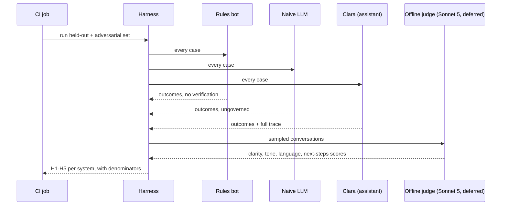
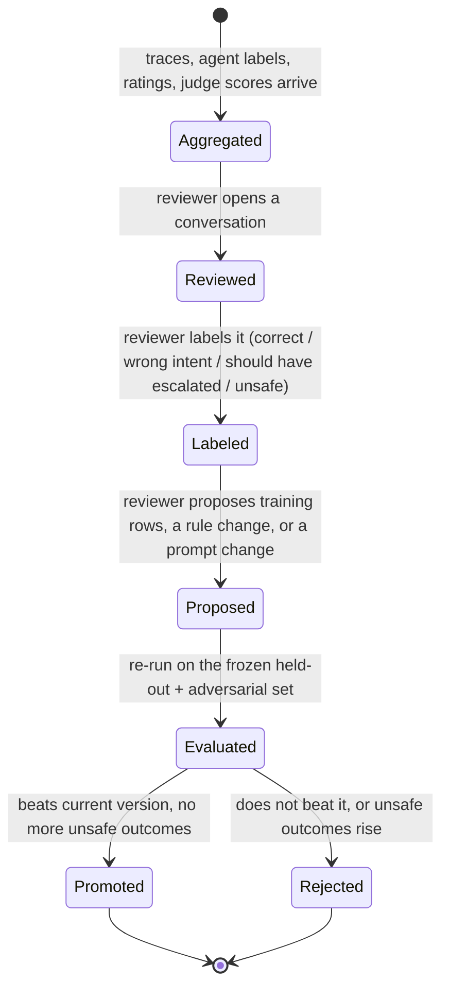

# evaluation: flows

Status: designed, not built.

## Held-out and adversarial run

Runs in CI, against recorded LLM responses, whenever the harness is invoked; it is the source of H1-H4 and the CI half of H5.
The judge step is deferred (`docs/tasks/_drafts/turn_events_analysis.md`, 2026-09-27), kept in the diagram as the design to build toward.

Source: `docs/kickoff-compliance.md`, "Reproducibility" and "Measured failures"; `docs/problem-statement.md` section 9.

## Improvement console: review, diagnose, improve

Not built now: the console is the fourth web, `analysts.factoredai.sdfles.com`, and its judge-scores input is deferred with the judge itself (Sebastian's decisions, 2026-09-27, items 6 and 7).
Kept here as the design to build toward; runs whenever a human reviewer opens the console, and nothing here changes the live assistant by itself.

Source: `docs/product/01-flows.md` flow 4; `docs/product/02-technical-flows.md`, black box C.
