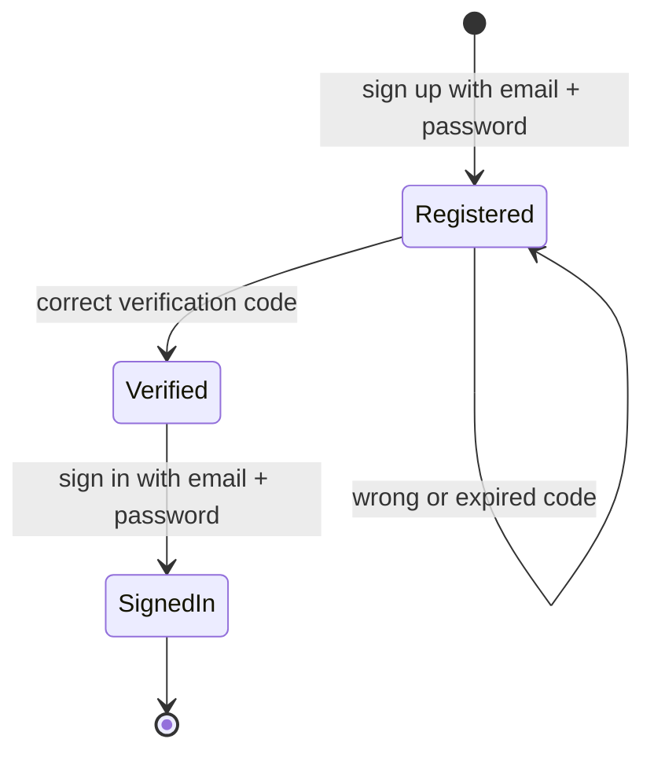
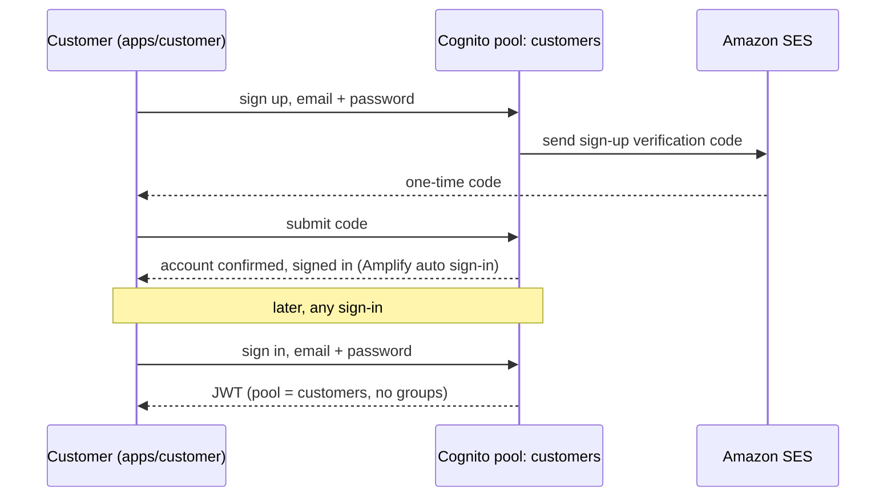
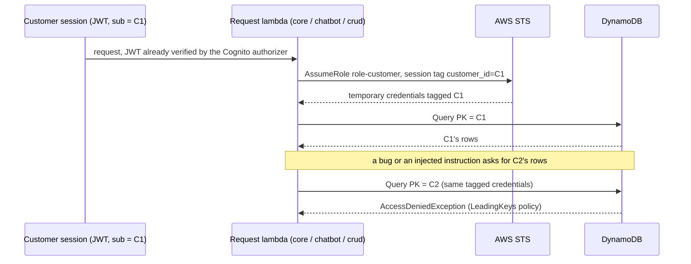

# Identity: flows

Status: the customer flow and the role assumption run since task 0003; staff sign-in is designed, not built.

## Customer sign-up and sign-in (email and password)

Sign-up runs once per customer; sign-in runs every time a customer opens factoredai.sdfles.com without a valid session.
The emailed code below is a one-time sign-up verification, not a login step: it never appears again on later sign-ins and never appears as a step-up on a write.

## A lambda assumes a role to read the customer's own data

Runs on every authenticated request that needs DynamoDB, after API Gateway's Cognito authorizer has already validated the JWT.
This replaces the older "Engine (FastAPI)" framing in `docs/product/02-technical-flows.md`: the caller here is a Python lambda behind API Gateway, and it performs the `AssumeRole` itself, not a separate IdP or engine process.

The denial comes from the IAM `LeadingKeys` policy on `role-customer`, not from the lambda's own code.
An agent or officer request follows the same shape, assuming `role-agent` or `role-officer` instead, tagged from `cognito:groups` rather than `customer_id`.
A `role-analyst` exists for the same reason but is unused until the improvement console (analysts.factoredai.sdfles.com) is built.
