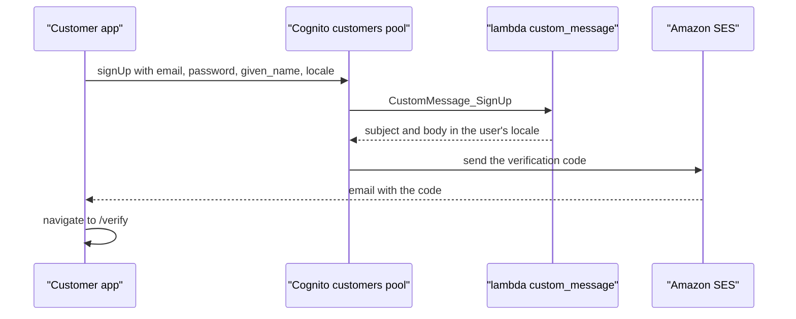
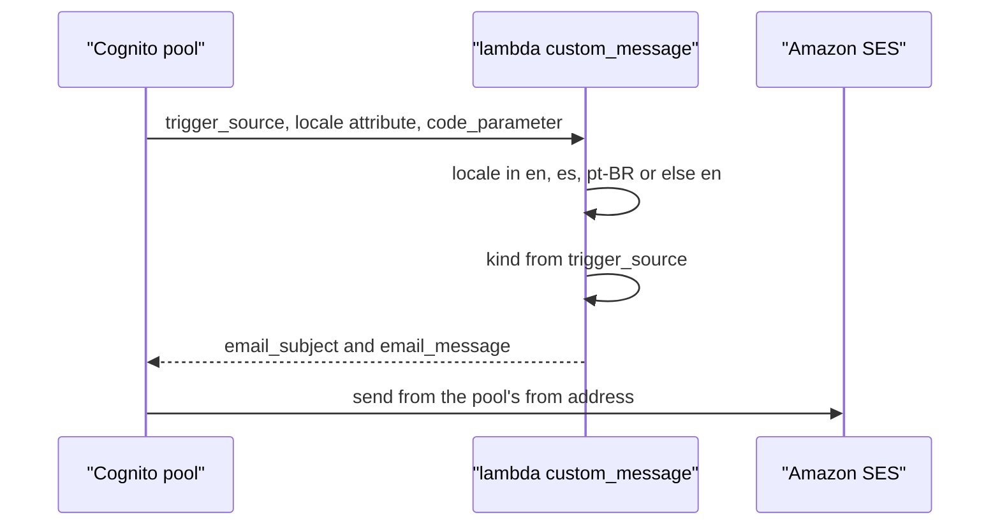
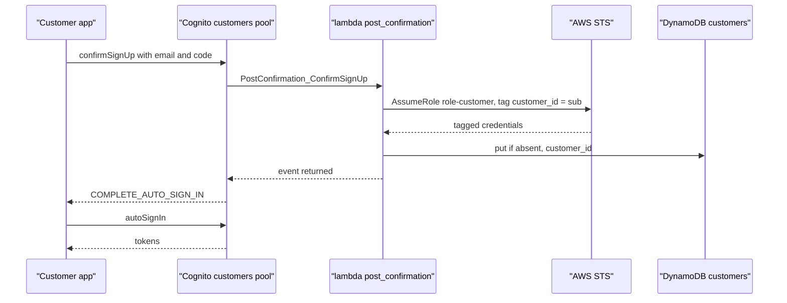
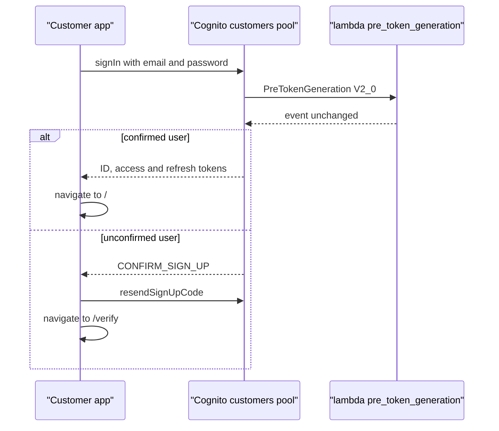
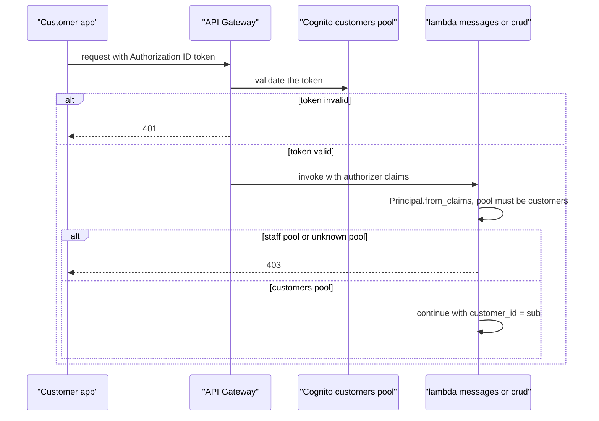
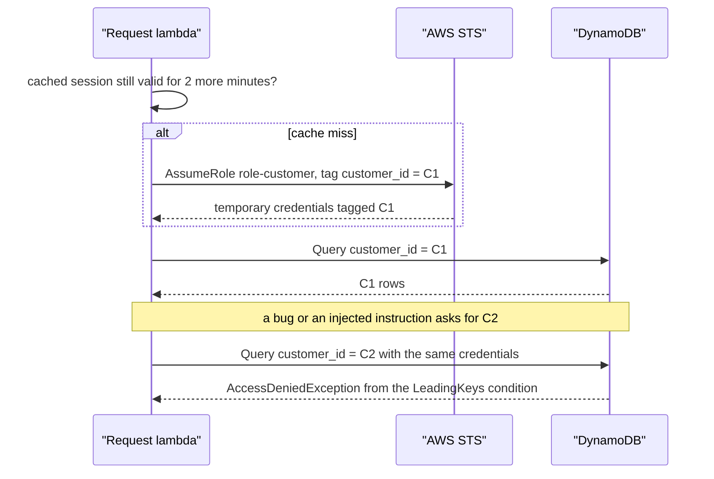
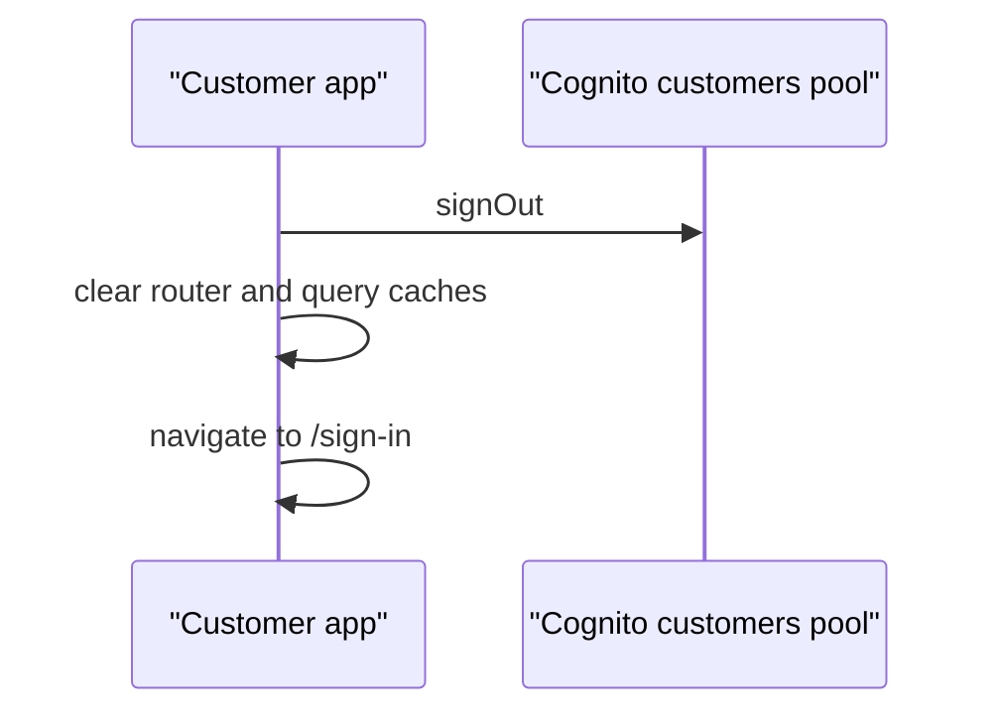

# Identity: flows

Customers register and sign in against the Cognito `customers` pool from `apps/customer`.
Lambdas never see a password: they receive verified claims from API Gateway and turn them into a tagged DynamoDB role.
The `staff` pool exists in `infra/stacks/backend/cognito.tf` (admin-created users, groups `agents`, `officers`, `analysts`), but no lambda serves a staff token.

## Sign up a customer

Sign-up creates an unconfirmed Cognito user and emails a one-time code.
The code is a sign-up step only: sign-in never asks for it again.

1. `SignUpPage` in `apps/customer/src/auth/sign-up-page.tsx` collects given name, email and a password of at least 10 characters.
2. It calls Amplify `signUp` with `userAttributes` `email`, `locale` (the app's current locale) and `given_name` (trimmed, at most 50 characters in the form), and `autoSignIn: true`.
   Amplify is configured in `apps/customer/src/amplify.ts` with the pool, the `customer` app client, `signUpVerificationMethod: "code"` and email as the login.
3. The customers pool (`self_sign_up = true`, `username_attributes = ["email"]`, `infra/modules/aws/cognito_user_pool/main.tf`) enforces the password policy: 10 characters or more with lower case, upper case, number and symbol.
4. Cognito invokes `custom_message` with `CustomMessage_SignUp` (see "Email every code in the recipient's locale"), and SES delivers the code.
5. The page navigates to `/verify` with the email.

## Email every code in the recipient's locale

One lambda, `handler` in `lambdas/auth/src/auth/custom_message.py`, writes every email either pool sends.
Cognito only supplies the code and, for invitations, the username.

1. `CustomMessageTriggerEvent` gives the `trigger_source` and the user's `locale` attribute.
2. The locale is used when it is `en`, `es` or `pt-BR` and falls back to `en` otherwise.
3. `KINDS` maps the trigger to a kind:
   - `CustomMessage_SignUp`, `ResendCode`, `UpdateUserAttribute`, `VerifyUserAttribute` and `Authentication` are `code`.
   - `CustomMessage_ForgotPassword` is `reset`.
   - `CustomMessage_AdminCreateUser` is `invitation`, which shows the username and the temporary password and asks for a new one within 3 days.
   - Any other source is `code`.
4. `EMAILS[locale][kind]` gives the subject and the sentence, and `render` wraps them with the code Cognito substitutes in `code_parameter`.
5. The response sets `email_subject` and `email_message`, and Cognito sends it through SES (`email_sending_account = "DEVELOPER"`, the pool's `from_email_address` and the SES identity).

Only the code and invitation kinds are reachable from the customer app today: it has no password reset screen, and invitations belong to the staff pool, where only an admin creates users.

## Confirm sign-up and create the customer row

Confirming the code is what creates the `customers` item.
The item is keyed by the Cognito `sub`, which is the `customer_id` everywhere else.

1. `VerifyPage` in `apps/customer/src/auth/verify-page.tsx` calls `confirmSignUp` with the email and the trimmed code.
   A wrong or expired code shows an error and the user stays on the page.
   `resendSignUpCode` asks for a new code through the `CustomMessage_ResendCode` path.
2. On a correct code Cognito confirms the user and invokes `handler` in `lambdas/auth/src/auth/post_confirmation.py`.
3. For any trigger source other than `PostConfirmation_ConfirmSignUp`, the lambda logs and returns.
4. Otherwise it takes `customer_id` from `user_attributes["sub"]` and calls `customer_session(customer_id, "auth")` (see "Assume role-customer for the customer's data"), tagged with that new id.
5. `create_customer` in `lambdas/core/src/core/customers.py` calls `put_if_absent` on `customers` with `customer_id`, `email`, `created_at` and `given_name` when it is 1 to 50 characters after trimming.
   The conditional write makes a replayed trigger harmless: `first_write` is false and the `SignUps` metric is not incremented.
6. Back in the page, `nextStep.signUpStep === "COMPLETE_AUTO_SIGN_IN"` runs `autoSignIn` and navigates to `/`.
   Otherwise it navigates to `/sign-in`.

## Sign in

A signed-out customer reaches `/sign-in`, enters email and password and gets Cognito tokens.

1. The route guard in `apps/customer/src/router.tsx` calls `getCurrentUser`.
   Without a session, any app route redirects to `/sign-in`, and a signed-in user is redirected away from the auth pages.
2. `SignInPage` calls Amplify `signIn` with email and password.
   The app client allows SRP and refresh tokens, and the password flows only when `cognito_allow_password_auth` is set (off by default).
3. Cognito authenticates and invokes `handler` in `lambdas/auth/src/auth/pre_token_generation.py` (V2_0).
   The lambda only logs `trigger_source`, `user_pool_id` and `client_id` and returns the event, so tokens carry no custom claims and no `cognito:groups` for a customer.
4. The result is an ID token and an access token valid for 60 minutes, and a refresh token valid for 30 days.
5. The page branches on `nextStep.signInStep`:
   - `DONE` navigates to `/`.
   - `CONFIRM_SIGN_UP` (the user never entered the code) calls `resendSignUpCode` and navigates to `/verify`.
   - Any other step shows an error.
6. `applyProfileLanguage` in `apps/customer/src/app/profile-language.ts` uses the customer's stored language and, when there is none, the `locale` claim of the ID token.

## Authenticate an API request

Every call from the app carries the ID token, and API Gateway checks it before any lambda runs.
The lambda then decides who the caller is from the verified claims.

1. `createHttp` in `apps/customer/src/api/http.ts` sends the token from `idToken` in `apps/customer/src/api/session.ts` (`fetchAuthSession`) as the `Authorization` header.
2. The REST API (`infra/stacks/backend/api.tf`, `infra/modules/aws/rest_api/main.tf`) puts a Cognito user pools authorizer on every route, with both pool ARNs as providers.
   An invalid or expired token is rejected there with 401.
3. The lambda reads `request_context.authorizer.claims` and calls `Principal.from_claims` in `lambdas/core/src/core/access.py`.
4. `from_claims` maps the last segment of `iss` to `CUSTOMERS_POOL_ID` or `STAFF_POOL_ID`, requires a non-empty `sub`, and reads `cognito:groups` (a list, or the string form API Gateway passes).
   An unknown pool raises `AccessDenied`.
5. `_customer` in `lambdas/messages/src/messages/handler.py` and `lambdas/crud/src/crud/handler.py` turns `AccessDenied` into 403 and also rejects any principal whose pool is not `customers`.
   A staff token therefore never reaches data, and the customer's `sub` is the only identity the rest of the request uses.

## Assume role-customer for the customer's data

No lambda touches a customer table with its own execution role.
It assumes `role-customer` with the customer id as a session tag, and IAM limits that session to the customer's own partition key.

1. A handler (`messages`, `crud`), the `chatbot` or `post_confirmation` calls `customer_session(customer_id, service)` in `lambdas/core/src/core/access.py`.
2. `_assume` looks up `(role, session name, tags, policy)` in a per-container cache of up to 128 sessions and reuses a session that expires more than two minutes from now.
3. Otherwise it calls STS `AssumeRole` on `ROLE_CUSTOMER_ARN` with `RoleSessionName` `{service}-{customer_id}` (cut to 64 characters), tag `customer_id`, and `DurationSeconds` 900.
   With `read_only=True` it also passes an inline policy of `GetItem`, `BatchGetItem` and `Query`, which narrows the role further.
4. The trust policy in `infra/stacks/backend/access.tf` admits only the roles of `crud`, `messages`, `chatbot` and `auth-post-confirmation`, and only with a non-empty `customer_id` tag as the single tag key.
5. `RoleSession.dynamodb` builds a DynamoDB resource from the returned credentials, and the lambda queries with it.
6. The role policy allows `dynamodb:LeadingKeys` equal to `${aws:PrincipalTag/customer_id}` on every customer-owned table.
   Reads cover `customers`, `products`, `transactions`, `complaints`, `rooms`, `messages` and `memory`.
   Writes cover `products`, `complaints`, `rooms` and `messages`, creates cover `customers` and `memory`, updates cover `customers`, and batch writes cover `transactions`.
7. A request for another customer's key, from a bug or an injected instruction, is answered with `AccessDeniedException` by IAM, not by the lambda.

`session_for` in the same file assumes `role-agent`, `role-officer` or `role-analyst` for a staff principal that carries exactly one of the groups `agents`, `officers` or `analysts`, with no session tag.
No handler calls it, so these roles are reachable only through the trust policies and never by a request.

## Sign out

Signing out clears the session and every cached trace of the customer.

1. `leave` in `apps/customer/src/app/app-layout.tsx` calls Amplify `signOut`, clears the router cache and navigates to `/sign-in`.
2. The `/sign-in`, `/sign-up` and `/verify` routes run `onlySignedOut`, which clears the query cache, forgets the Clara session and resets the locale to the signed-out one.

