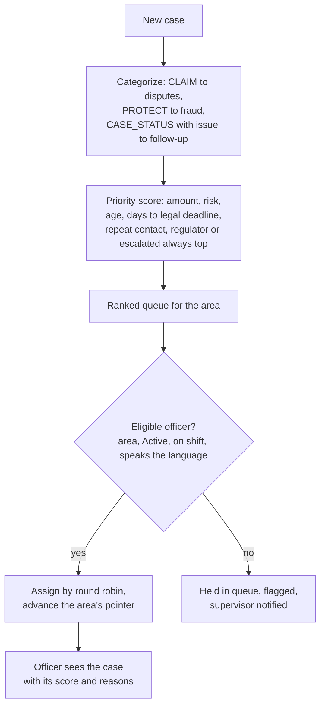
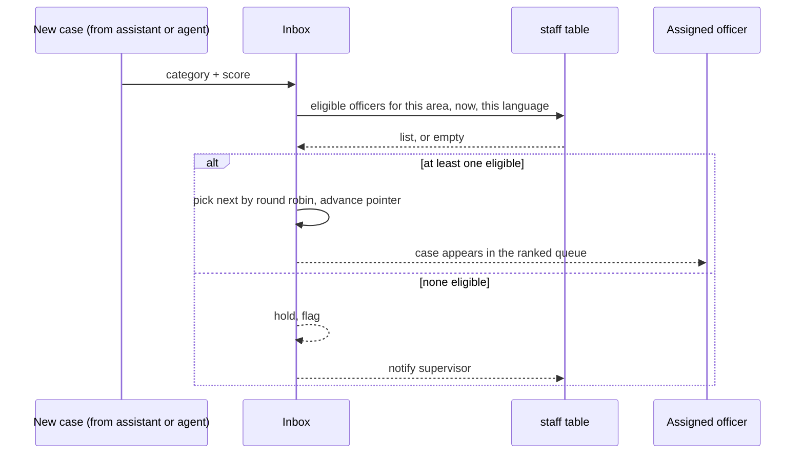

# Inbox: flows

Status: designed, not built.

## Categorize, rank, assign

Runs once per case, when the case arrives from the assistant or from an agent's transfer (`docs/product/02-technical-flows.md`, black box B).

## Assignment eligibility, as a sequence

