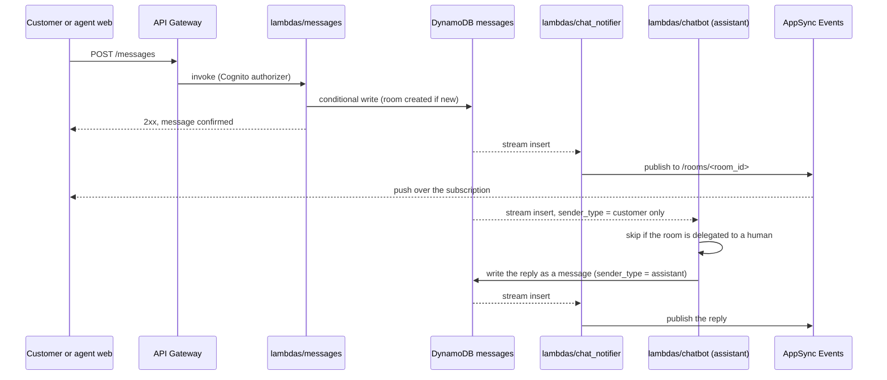

# Messaging: flows

Status: infrastructure built (task 0002), code not built.

## Message round trip

The same path carries a customer's message, Clara's reply and a human agent's message.
The request that sends a message only waits for the write; everything else reacts to the table's stream.

Clara's reply never triggers Clara again: the chatbot mapping only passes `sender_type = customer`.
A record that fails three times goes to its consumer's DLQ, which unblocks the rest of that customer's messages.
