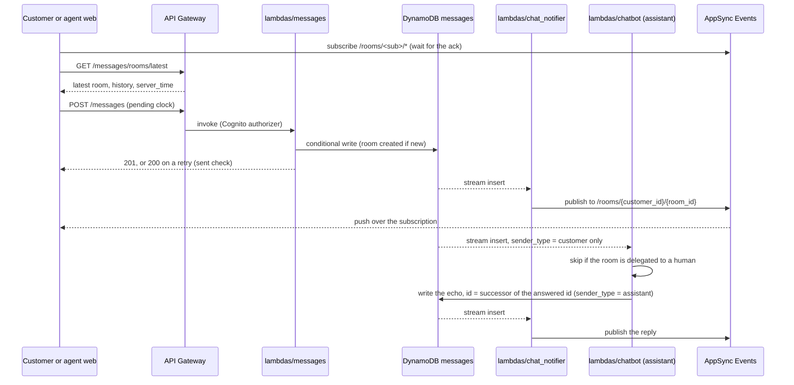

# Messaging: flows

Status: built for customers (task 0003).

## Message round trip

The same path carries a customer's message, Clara's reply and, later, a human agent's message.
The request that sends a message only waits for the write; everything else reacts to the table's stream.
The client subscribes before it reads history or sends, so nothing falls between the two; it merges history, pushes and confirmations by `message_id`.

Clara's reply never triggers Clara again: the chatbot mapping only passes `sender_type = customer`.
A record that fails three times goes to its consumer's DLQ, which unblocks the rest of that customer's messages.
