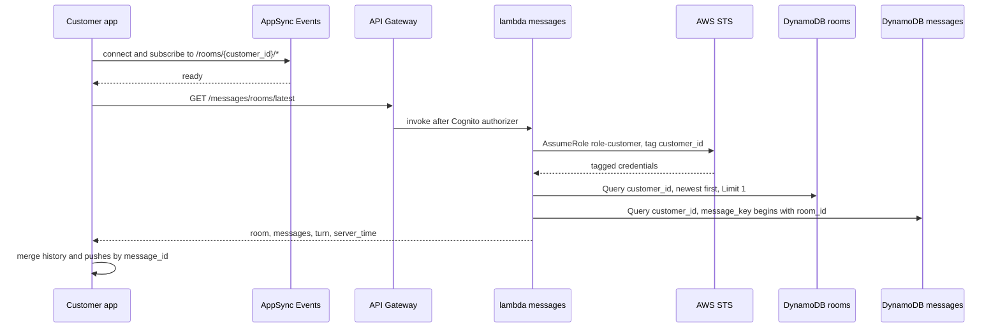
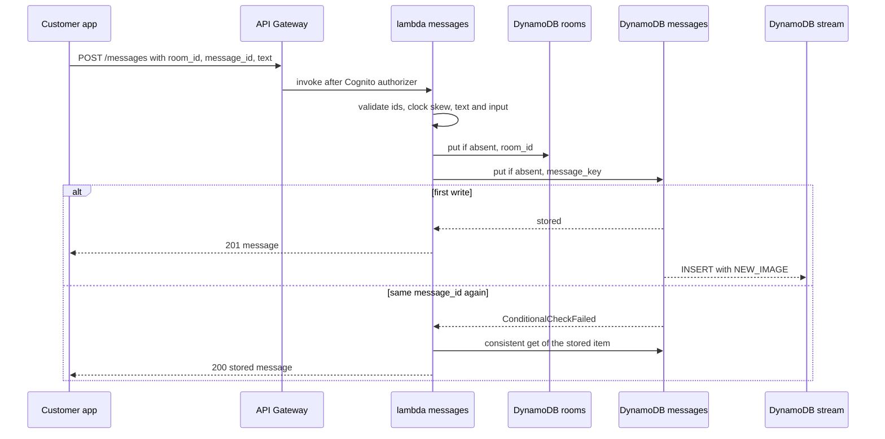
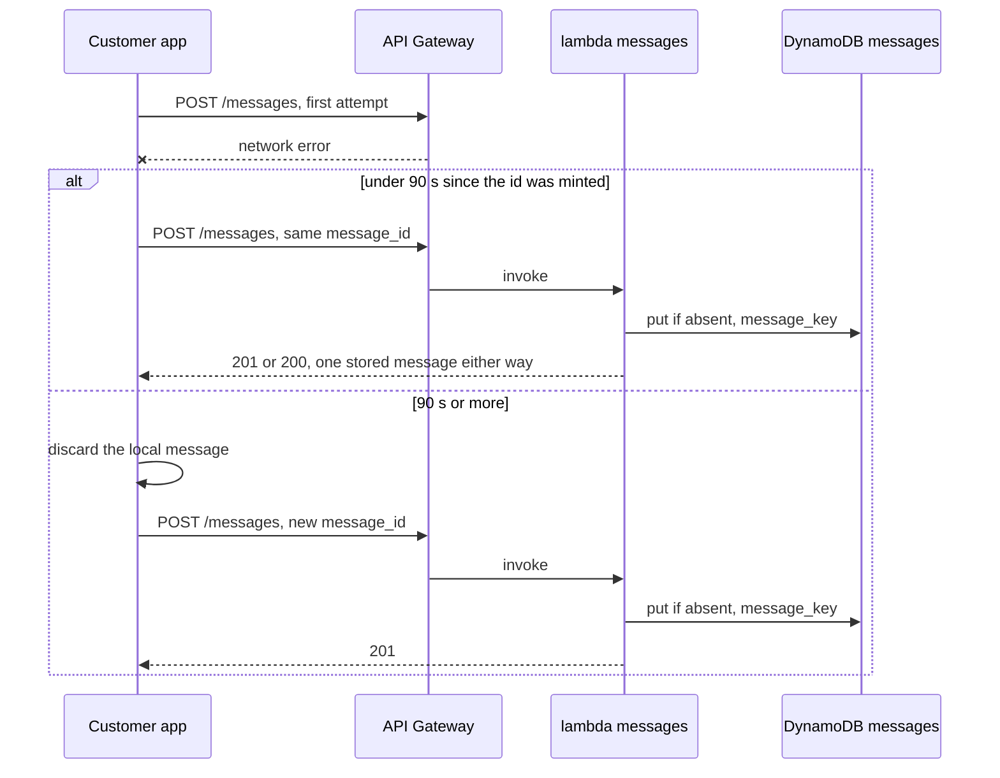
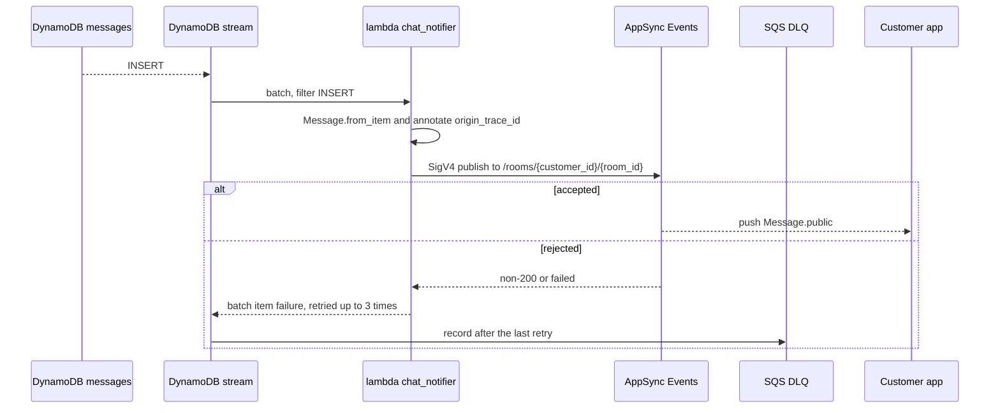
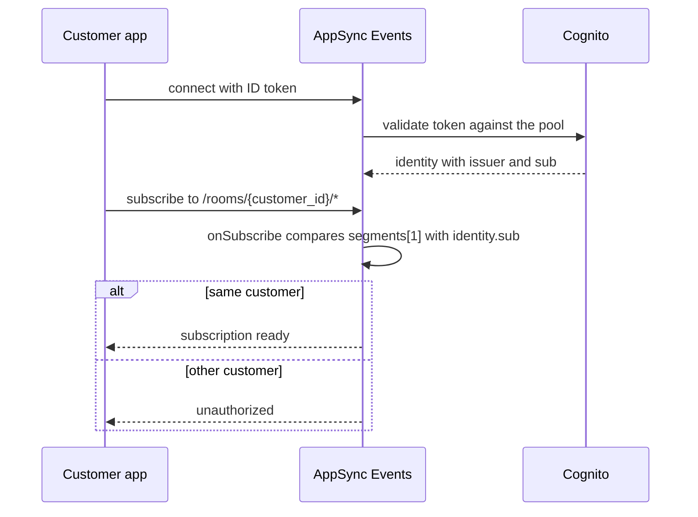
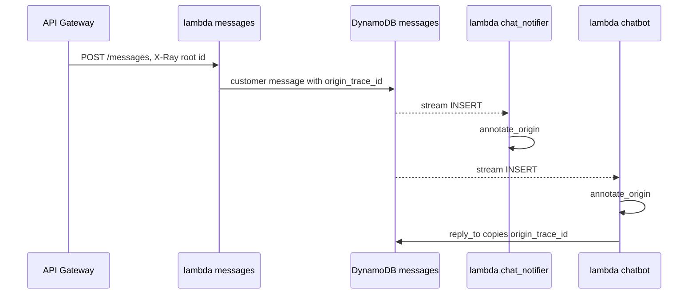

# Messaging: flows

The messages API has two routes, `GET /messages/rooms/latest` and `POST /messages`, both behind the Cognito authorizer and served by `lambdas/messages`.
Everything that reaches the customer after a write is a reaction to the `messages` table stream, never part of the request.

## Open the chat

The client subscribes before it reads history, so a message that lands between the two is not lost.
History, pushes and send confirmations merge by `message_id`.

1. `useChat` in `apps/customer/src/chat/use-chat.ts` runs `open`, which calls `subscribeToRooms` in `apps/customer/src/chat/realtime.ts`.
   It connects to `/rooms/{customer_id}/*` on AppSync Events (endpoint and user pool auth set in `apps/customer/src/amplify.ts`) and waits for `subscription.ready`.
2. AppSync Events runs `onSubscribe` before the ack (see "Authorize a room subscription").
3. The client calls `api.latestRoom()` in `apps/customer/src/chat/api.ts`, which sends `GET /messages/rooms/latest` with the Cognito ID token.
4. API Gateway validates the token and invokes `latest_room` in `lambdas/messages/src/messages/handler.py`.
   `_customer` builds a `Principal` from the claims and rejects any token that is not from the customers pool with 403.
5. `customer_session` in `lambdas/core/src/core/access.py` assumes `role-customer` tagged with the customer id, and `Messaging.latest_room` queries `rooms` by `customer_id` in descending order with `Limit=1`.
   Room ids are UUIDv7, so the last key is the newest room.
6. `Messaging.history` queries `messages` for keys beginning with `{room_id}#`, consistent read, following `LastEvaluatedKey` until the room is complete.
7. The handler returns `room` (`room_id`, `created_at`, or `null`), `messages` (each through `Message.public`), `turn` and `server_time`.
   `Room.turn` returns the assistant's turn mark only while it is younger than five minutes.
8. The client calls `clock.sync` with `server_time` and dispatches `loaded`, which merges history with anything already pushed.
   A customer without a room gets `room: null`, and the first send mints the room id.
9. When the subscription errors, `retryLater` retries with a delay from 1 s doubling up to 30 s.
   Returning to a hidden tab or coming back online (`watchReturn` in `apps/customer/src/chat/catch-up.ts`) runs steps 1 to 8 again, which is how missed pushes are recovered.

## Send a message

A customer message is one conditional write.
The request waits for that write and nothing else.

1. `useChat.send` mints `room_id` (the current room, or a new UUIDv7 on a first message) and `message_id` (UUIDv7 from the synced clock, `mintId` in `apps/customer/src/chat/clock.ts`).
   It adds the message locally as `sending` and calls `api.send`, which sends `POST /messages` with `room_id`, `message_id`, `text` and optionally `input` (a tap on an assistant question or a charge topic).
2. `createHttp` in `apps/customer/src/api/http.ts` resends the same body after 400, 1200 and 3000 ms on a network error, 429 or 5xx.
3. API Gateway validates the token and invokes `send_message` in `lambdas/messages/src/messages/handler.py`.
   `_customer` accepts customers-pool tokens only, and a body that is not a JSON object or lacks string `room_id`, `message_id` or `text` is a 400.
4. `customer_message` in `lambdas/core/src/core/messaging.py` validates and builds the item:
   - `room_id` and `message_id` must be lowercase canonical UUIDv7.
   - `sent_at` is the timestamp inside `message_id`, and it must be within two minutes of server time.
   - `text` is trimmed, non-empty and at most 2000 characters.
   - `input` goes through `structured`: either a tap (`ask_id`, `option`, optional `note`) or a charge topic (`type`, `product_id`, `transaction_id`).
   - `origin_trace_id` is the X-Ray root of this invocation (`trace_id` in `lambdas/core/src/core/observability.py`).
   A violation is a 400.
5. `Messaging.send` first runs `_open_room`, a `put_if_absent` on `rooms` with `delegated_to_human = false`, so the room exists after the first message and an existing room is left untouched.
6. `Messaging.write` calls `put_if_absent` in `lambdas/core/src/core/conditional.py` on `messages` with `attribute_not_exists(message_key)`.
   The key is `{room_id}#{sent_at}#{message_id}`, so the same `message_id` always collides with itself.
7. On a collision the handler reads the stored item with a consistent read and returns it unchanged.
   The response is `201` with `{"message": ...}` on the first write and `200` with the same body on a retry, through `Message.public` (no `customer_id`, `origin_trace_id` or `input`).
8. The client dispatches `confirmed`, which replaces the pending message by `message_id`.
9. The new item enters the stream (see "Publish a stored message to the room"), and the assistant reacts to it (see Assistant: Answer a customer message).

A room flagged `delegated_to_human` gets no reply from the assistant.
Nothing in this repo sets the flag, so it stays `false`.

## Retry a failed send

A send that fails shows a retry action on the message.
The retry reuses the id while the server would still accept it, so a write that did land is not duplicated.

1. `retry` in `apps/customer/src/chat/use-chat.ts` compares `idTime(message_id)` with `clock.now()`.
2. Under 90 s, it calls `deliver` again with the same `room_id`, `message_id`, text and input, and the server answers as in steps 5 to 7 of "Send a message": a new write returns `201`, a write that had landed returns `200`.
3. At 90 s or more, it dispatches `discarded` to drop the local message and sends the same text with a fresh `message_id`, because the old id would fail the two-minute skew check in `customer_message`.

## Publish a stored message to the room

Every insert into `messages` is pushed to the room channel, whoever wrote it: the customer through `send_message`, or the assistant through its reply.
Updates and deletes are not pushed.

1. `streams.tf` maps the `messages` stream (`NEW_IMAGE`) to `lambdas/chat_notifier` with a filter on `eventName = INSERT`, batches of 10, start at `LATEST` and `ReportBatchItemFailures`.
2. `handler` in `lambdas/chat_notifier/src/chat_notifier/handler.py` runs `notify` for each record through `process_partial_response`.
3. `notify` builds `Message.from_item` from the new image and calls `annotate_origin`, which puts `origin_trace_id` on this lambda's X-Ray segment.
4. `Publisher.publish` in `lambdas/core/src/core/realtime.py` signs a request with SigV4 for `appsync` and posts `{channel, events}` to `REALTIME_HTTP_URL`.
   The channel is `room_channel(customer_id, room_id)`, which is `/rooms/{customer_id}/{room_id}`, and the event is `Message.public()`.
5. A status other than 200, or a non-empty `failed` in the answer, raises `PublishRejected`, and that record is reported as a batch item failure.
6. After three retries (`maximum_retry_attempts`, with `bisect_batch_on_function_error`) the record goes to the `chat-notifier` SQS dead letter queue and the shard moves on.
7. AppSync Events delivers the event to every subscriber of `/rooms/{customer_id}/*`.
   The client's `received` action merges it by `message_id`, so the echo of a message the customer just sent only confirms it.

The namespace accepts publishes from IAM only, so no client can publish to a channel.
The assistant publishes status events on the same channels, see Assistant: Show turn progress.

## Authorize a room subscription

AppSync Events asks `onSubscribe` before it accepts any subscription to the `rooms` namespace.
Subscribing is the only client operation on the namespace, and a customer can only listen to their own channels.

1. The client connects with its Cognito ID token (`defaultAuthMode: "userPool"` in `apps/customer/src/amplify.ts`).
   The AppSync API lists both the customers and the staff pool as token providers.
2. For a subscription to `/rooms/{customer_id}/*`, AppSync Events runs `onSubscribe` in `infra/stacks/backend/handlers/rooms.js`, injected as `code_handlers` by `infra/stacks/backend/realtime.tf`.
3. A token whose issuer is the staff pool is accepted without further checks.
   No app in this repo subscribes with one.
4. Otherwise `ctx.info.channel.segments[1]` must be non-empty and equal to `ctx.identity.sub`.
   If not, `util.unauthorized()` rejects the subscription.
5. The wildcard in the last segment is allowed, since only the customer id segment is compared.

## Follow one message across lambdas

A message carries the trace id of the request that created it, so the whole chain can be found from one X-Ray trace.

1. `customer_message` stores `origin_trace_id` on the item (the `Root` of `_X_AMZN_TRACE_ID` in the messages lambda).
2. `reply_to` copies it onto the assistant's reply, so the reply keeps the id of the customer message it answers.
3. `chat_notifier` and `chatbot` call `annotate_origin` on their own segments with the id read from the stream image.
4. `Message.public` leaves `origin_trace_id` out, so the client never sees it.

