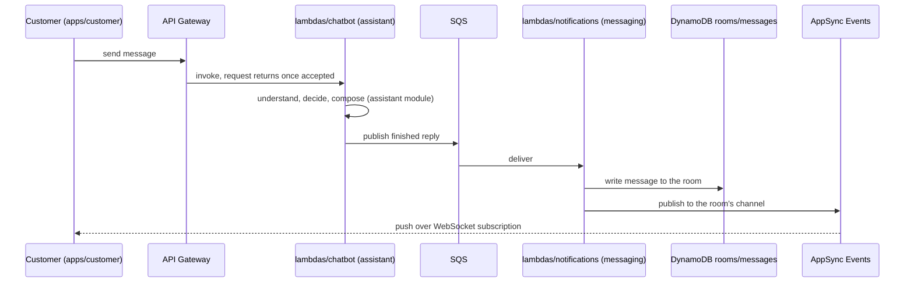

# Messaging: flows

Status: designed, not built.

## Message round trip

Runs on every customer message, and again on every human agent message once a handoff has happened.
The reply never travels back on the request that sent the message; it arrives over the room's realtime channel instead, which is why `lambdas/chatbot` and `lambdas/notifications` never call each other directly (module brief; `docs/tasks/_drafts/architecture_and_layout.md`, "no lambda-to-lambda calls").

The same queue and the same consumer carry a human agent's message once the assistant hands the room off (`docs/product/01-flows.md` flow 2): API -> SQS -> notifications, confirmed for both bot and agent (setup decision, 2026-09-27).
Which lambda owns the API route an agent's message enters through before reaching SQS is not decided yet [inferido].
