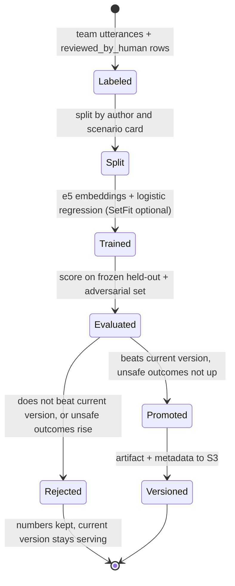
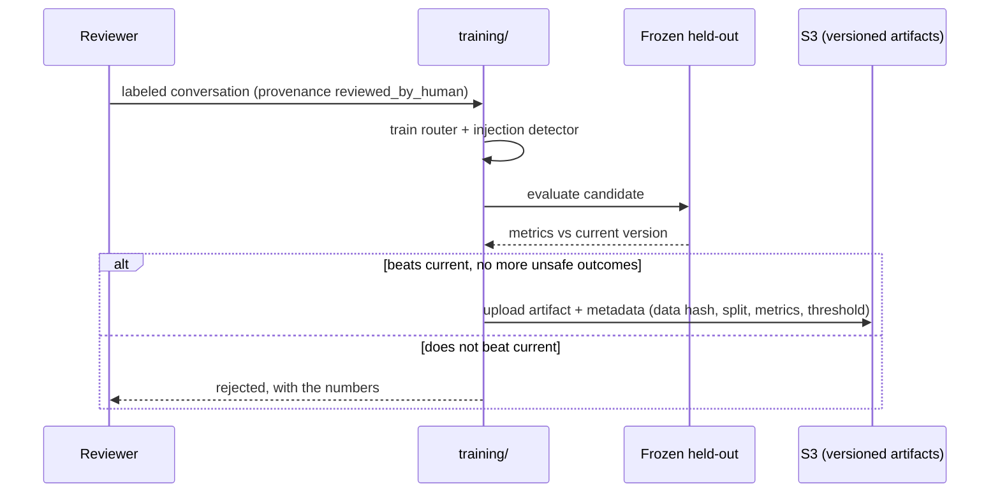

# models: flows

Status: designed, not built.
Only the training and promotion loop is diagrammed; everything else in this module is a training script, not a flow.

## Train, evaluate, promote or reject

Runs whenever the labeled utterance set changes, or after a batch of human-reviewed conversations becomes new training rows (`docs/product/02-technical-flows.md`, "Black box C").

